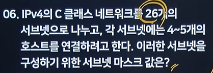

# 2025 1 회 기출

# 네트워크 보완

- 문제
    1. 
    
    **다음은 네트워크 보완에 관련된 문제이다. 괄호안에 알맞는 용어를 작성하시오.**
    
    (   )은/는 '세션을 가로채다.' 라는 의미로 다른 사람의 세션 상태를 훔치거나 도용하여 액세스하는 해킹 기법이다.
    
    TCP (   )은/는 TCP의 3-way 핸드셰이크가 완료된 후에 공격자가 시퀀스 번호 등을 조작하여 정상적인 세션을 가로채고 인증 없이 통신을 탈취하는 공격 공격이다.
    
    1. 
    
    **다음은 악성코드 관련된 문제이다. 아래 내용을 확인하여 보기에 골라 작성하시오.**
    
    사용자가 원치 않는 소프트웨어를 구매하도록 조작하기 위해 사회 공학을 사용하여 충격, 불안 또는 위협에 대한 인식을 유발하는 악성 소프트웨어의 한 형태이다.
    
    ‘겁을 주다’라는 영어 단어에서 유래한 것으로 공포를 이용하여 피해자를 속여 대가를 지불 하거나 특정 행동을 유도하는 랜섬웨어이다.
    
    가짜 바이러스 경고나 시스템 문제를 표시하여 사용자가 돈을 지불하거나 특정 소프트웨어를 설치하도록 속이는 방식으로 작동한다.
    

### 소프트웨어 개발 보안의 3대요소

### 기무가

기밀성 : 인가되지않은 접근에 정보 노출을 차단하는 특성

무결성: 정당한 방법으로만 데이터를 변경할 수 있으며, 데이터의 정확성을 보장하는 특성

가용성 : 권한을 가지고 있으면 서비스를 지속해서 사용할 수 있도록 하는 특성 , 인가된 사용자만 정보자산에 접근할 수 있다.

## 네트워크 서비스 공격

Dos: 시스템의 자원을 고갈시켜 서비스 거부를 유발(공격자가 단일 시스템)

DDos: 여러대의 공격자를 분산 배치 후 동시에 동작시키는 Dos공경 

## Dos

시스템에 비정상적인 양의 트래픽을 보내서 자원을 소모 하게 만듬 

- Smurf Attack(스머프/ 스머핑)
    - 출발지 IP를 공격대상의 IP로 변조하여, 브로드캐스팅으로 ICMP Echo 패킷 요청을 보내 과부화 시킴
- SYN 플러딩
    - ACK를 발송하지 않고 SYN 패킷만 보내 점유하여 자원을 고갈시키는 공격
- UDP 플러딩
    - 대량의 UDP 패키지를 임의의 포트번호로 전송하지만, 응답메세지는 공격자에 전달되지않아 자원을 고갈시키는 공격
- Ping 플러딩
    
    
- Ping of Death
    - ICMP 패킷(핑)을 아주 크게 만들어 과부화 시키는 공격
- Treadrop Attack
    - 조작된 IP 패킷 조각을 보내 재조립 과정에서 오류를 발생시킴
- Land Attack
    - 출발지 IP와 도착지 IP를 같은 주소로 만들어, 자기 자신에게 응담을 보내도록 하는 공격

- 퀴즈
    - 출발지 IP를 공격대상의 IP로 변조하여, 브로드캐스팅으로 ICMP Echo 패킷 요청을 보내 과부화 시킴
    
    답:
    
    - ICMP 패킷(핑)을 아주 크게 만들어 과부화 시키는 공격
    
    답:
    
    - 조작된 IP 패킷 조각을 보내 재조립 과정에서 오류를 발생시킴
    
    답:
    
    - 대량의 UDP 패키지를 임의의 포트번호로 전송하지만, 응답메세지는 공격자에 전달되지않아 자원을 고갈시키는 공격
    
    답:
    
    - ACK를 발송하지 않고 SYN 패킷만 보내 점유하여 자원을 고갈시키는 공격
    
    답:
    
    Land Attack 과  Smuf 의 차이 
    
    답:
    

## DDos

여러대의 시스템을 분산하여 동시에 특정 서버를 공격 

공격 구성요소

- handler: 마스터 시스템의 역할을 수행
- Agent : 공격 대상에 직접 공격을 가함
- Master : 공격자에게 직접 명령 Agent를 관리함
- Attacker : 공격을 주도
- Daemon: 에이전트 시스템의 역할을 수행하는 프로그램

공격 방식 

감영된 다수의 장치들이 동시에 공격 대상 서버에 트래픽을 전송해 자원을 고갈시킴. 공격자는 여러 출처에서 트래픽을 발생시켜 방어 시스템을 우회할 수 있음 .

## 이 외의 보안 공격기법

- 스니핑
    - 네트워크상 통과되는 패킷들의 내용을 엿보는 행위.
    - 네트워크에서 전송되는 데이터를 몰래 가로채는 보안 공격 기법, 공격자가 패킷 분석도구를 사용해 민감한 정보를 탈취 할 수 있음.
- SQL 삽입
    - 응용프로그램의 취약점을 이용해 악의적인 SQL 구문을 삽입.
- 세션 하이재킹
    - 사용자가 웹서버나 애플리케이션과 통신하는 동안, 공격자가 세션 식별정보를 가로채어 사용자의 세션을 탈취하는 공격 기법
- 스푸핑
    - 공격자가 신뢰 할 수 있는 시스템이나 사용자로 위장하여 공격 수행 하는 기법
- IP스푸핑
    - 공격자의 IP주소를 변조하여 공격대상 시스템에 신뢰받는 IP처럼 가장하는 방식
- ARP스푸핑
    - MAC 주소를 위장하여 패킷을 스니핑하는 공격
- DNS 스푸핑
- 루트킷
    - 관리자 권한을 탈취 하여 공격
- APT
    - Zero-Day 취약점 나오면 APT
    - 오랜시간동안은밀하고 지속적으로 수행
    
- 스캐어웨어
    - 사용자의 불안감을 자극하여 금전지불 악성프로그램 설치를 유도 - 불법사이트 경고!경고! 하는 느낌
- 퀴즈
    - 네트워크상 통과되는 패킷들의 내용을 엿보는 행위.
    - 네트워크에서 전송되는 데이터를 몰래 가로채는 보안 공격 기법, 공격자가 패킷 분석도구를 사용해 민감한 정보를 탈취 할 수 있음.
    - 답:
    - 공격자가 신뢰 할 수 있는 시스템이나 사용자로 위장하여 공격 수행 하는 기법
    - 답:ㄴ
    - Zero-Day 취약점
    - 답:
    - 관리자 권한을 탈취 하여 공격
    - 답:
    - 공격자의 IP주소를 변조하여 공격대상 시스템에 신뢰받는 IP처럼 가장하는 방식
    - 답:
    - 공격자가 신뢰 할 수 있는 시스템이나 사용자로 위장하여 공격 수행 하는 기법
    - 답:
    - MAC 주소를 위장하여 패킷을 스니핑하는 공격
    - 답:
    - 사용자가 웹서버나 애플리케이션과 통신하는 동안, 공격자가 세션 식별정보를 가로채어 사용자의 세션을 탈취하는 공격 기법
    - 답:

## 오류검출기법

- 문제 3
    
    (        ) 은/는 3글자의 영어 약자로 이루어진 오류 기법으로 데이터를 전송하거나 저장할 때 데이터의 오류를 감지하는 데 사용되는 오류 검출 코드이다.
    
    (        ) 은/는 데이터에 체크섬을 추가하여 데이터를 전송하거나 저장한 후, 수신 또는 읽을 때 이 체크섬을 다시 계산하여 데이터가 변경되었는지 확인하는 기법이다.
    
    (        ) 은/는 데이터 전송의 안정성을 높이는 데 중요한 역할을 한다.
    
    데이터는 이진수(0과 1)로 표현되며 정해진 다항식(x³ + x + 1)을 기반으로 데이터를 2진수 나눗셈하고나머지를 (       ) 값으로 삼는다.
    

오류 검출의 대표적인 방식

- parity check(패리티 검사): 데이터의 1의 개수를 기준으로 짝수 또는 홀수 패리티 비트를 추가하여 오류를 검출하는 단순한 방식
- CRC(순환 중복검사) : 데이터를 이진수 다항식으로 나눗셈한뒤 나머지를 붙혀 전송하고 수싲ㄴ측에서 다시 나눗셈 하여 오류를 검출함.
    - CRC는 전송하려는 데이터에 대해 정해진 다항식(예: x³ + x + 1)을 기준으로 **이진수 나눗셈**을 수행하고, 그 **나머지를 CRC 코드로 추가**하여 함께 전송하는 오류 검출 기법입니다.
- Block Sum Check(블록 합 검사): 데이터를 일정블록 단위로 나눈 후 각블록의 합계를 구해 체크값을 생성하고, 이를 이용해 오류를 검출함
- Hamming Code(해밍코드) : 데이터에 여러개의 패리티 비트를 삽입해 단일 비트 오류를 검출하고 위치까지 식별 및 복구할 수 있음.

## ARP/RARP

- 문제
    
    **아래 내용은 ARP/RARP에 대한 설명이다. 각 설명에 해당하는 것을 작성하시오.**
    
    ( 1 ) 은/는 네트워크상에서 IP 주소를 MAC 주소로 변환하는 프로토콜이고,
    
    ( 2 ) 은/는 MAC 주소를 IP 주소로 변환하는 프로토콜이다.
    

ARP

Address Resolution protocol

정의

ARP는 IP주소를 Mack주소로 변환 해 주기 위해 사용되는 동적 매핑 프로토콜

사용

목적지 호스트 IP주소는 아는데, MAC주소(물리적 주소)를 모를 경우 사용

RARP(ARP거꾸로)

: Reverse Address Resolution Protocol

## 정의

RARP는 MAC주소를 IP주소로 변환해주기 위해 사용되는 동적 매핑 프로토콜

## Data Base

- 문제
    
    **아래는 데이터베이스에 관련된 설명이다. 알맞는 용어를 보기에서 골라 괄호를 작성하시오.**
    
    1. 릴레이션에서 속성의 개수를 의미 : ( 1 )
    
    2. 릴레이션에서 튜플의 개수를 의미 : ( 2 )
    
    3. 한 릴레이션의 속상이 다른 릴레이션의 기본 키를 참조할 때, 참조하는 속성을 의미 : ( 3 )
    
    4. 특정 속성에 대해 입력될 수 있는 값의 유형이나 범위를 의미하고 무결성을 보장하는 기준 : ( 4 )
    

튜플 → 행 → cardinality(카디널리티) 기수

속성 → 열→ degree 차수 

도메인

- 하나의 속성이 취할 수 있는 같은 타입의 원자값들의 집합.

추가 

슈퍼키 (Super Key)

유일성을 만족하는 키 , 릴레이션에서 튜플을 식별하기 위해서 사용되는 속성 또는 속성들의 집합이다.

후보키(Candidate Key) 유일성, 최소성

유일성과 최소성을 동시에 만족하는 키 기본키가 될 수 있는 속성들의 집합 

기본키 (Primary key)

후보키중에서 선택된 키, NULL값을 가질 수 없고 중복이 없어야함 

대체키(Alternate Key)

후보키 중 기본키로 선택되지 않은 키 

외래키(Foreign Key)

다른 테이블의 기본키를 참조하는 속성 

## 서브넷

- 문제
    
    **IP 주소가 192.168.35.10, 서브넷 255.255.252.0인 PC에서 브로드캐스팅으로 다른 IP로 정보를 전달한다고 할 때 수신할 수 있는 알맞는 IP를 보기에서 골라 모두 작성하시오.**
    

24비트 까지 Network ID 

255.255.255 까지 네트워크 ID 각자 8비트씩 

255.255.255.(  ) 여기는 Host Id

192.168.0.1/25 → 25개를 NetworkID 로 쓰자 라는 것 

25개면 255.255.255. () → 8비트중 앞에 하나를 1로 치환   10000000 → 128

255.255.255.128→ 답

이런식의 문제는 000.000.0.0/26 이런 느낌이 아니고 

비트를 쪼개서 26개를 나누어 줄 수  있도록 마지막 비트수를 조정 하면 됨 

10000000 → 이건 앞에  0 과 1로 두개의 서브넷으로 나눌수 있고 

11000000 → 이건 01 10 11 00 → 4개  2^2

11100000→ 이건 2^3 =8 개 서브넷

11110000→ 이건 16개 의 서브넷으로 나눌 수 있음  -아직 26개를 나누기에 부족함

11111000→ 32개로 26 개 나눌 수 있음 

값은 248 이므로 

255.255.255.248 이 정답

 

이건 B클래스 부터 회사에 나누어 주겟다 

255.255./000.000→ 여기 부터 

11111111.11110000

1 자리가 서브넷 개수 4094

0자리 가 호스트 개수 

192.168.50.130 / 255.255.255.224

- 256 − 224 = **32**
- 마지막 옥텟 130 ÷ 32 = 4 → 4×32 = **128**
- ▶ 네트워크 주소: **192.168.50.128**
- ▶ 브로드캐스트: **192.168.50.159**
- ▶ 유효 호스트: **192.168.50.129 ~ 192.168.50.158**

네트워크: 192.168.50.128 / 브로드캐스트: 192.168.50.159 / 호스트: 129~158

203.10.14.145 / 255.255.255.240

- 256 − 240 = **16**
- 마지막 옥텟 145 ÷ 16 = 9 → 9×16 = **144**
- ▶ 네트워크 주소: **203.10.14.144**
- ▶ 브로드캐스트: **203.10.14.159**
- ▶ 유효 호스트: **203.10.14.145 ~ 203.10.14.158**

네트워크: 203.10.14.144 / 브로드캐스트: 203.10.14.159 / 호스트: 145~158

## 결합도

- 문제
    
    **다음은 결합도와 관련된 내용이다. 보기에 알맞는 답을 골라 작성하시오.**
    
    (1) 다른 모듈 내부에 있는 변수나 기능을 다른 모듈에서 사용하는 경우의 결합도
    
    (2) 모듈 간의 인터페이스로 배열이나 오브젝트, 자료구조 등이 전달되는 경우의 결합도
    
    (3) 파라미터가 아닌 모듈 밖에 선언되어 있는 전역 변수를 참조하고 전역 변수를 갱신하는 식으로 상호작용하는 경우의 결합도
    

결합도는 모듈간 상호의존정도를 의미

결합도가 낮을 수록 좋은 모듈

내공외제스자

내용 결합도 (가장 강함 안좋은것)

다른모듈 기능이용

한모듈이 다른 모듈의 내부 기능이나 자료를 직접 참조 하거나 수정할때의 결합도

공통 결합도

전역변수 사용

공통데이터 영역을 여러모듈이 사용할때의 결합도.

파라미터가 아닌 모듈 밖에 선언되어 있는 전역변수를 참조하고 전역 변수를 갱신하는 식으로 작용 

외부 결합도

한 모듈이 선언한 데이터를 다른모듈이 참조할때의 결합도.

어떤 모듈에서 선언한 데이터 (변수)를 외부 의 다른모듈에서 참조하는 경우 

제어 결합도

제어요소전달.

한 모듈이 다른 모듈의 내부 논리 흐름을 제어하기 위해 제어 신호나 제어요소를 전달하는 경우 

단순 처리 대상인 데이터만 절달되는게 아니라 어떻게 처리를 해야 한다는 제어요소가 전달 되는 경우 

스템프 결합도

배열 등 전달

배열이나 레코드 등의 자료구조가 전달될때 결합도.

자료 결합도 (결합도 가장 약 좋은것)

값 전달, 모듈간의 인터페이스가 단순한 자료요소로만 구성된 경우. 

모듈간의 인터페이스로 값이 전달

- 퀴즈
    
    다른 모듈 내부에 있는 변수나 기능을 다른 모듈에서 직접 사용하거나 수정하는 경우의 결합도는?
    
    모듈 간의 인터페이스로 배열, 레코드, 오브젝트 등 자료 구조 전체가 전달되는 경우의 결합도는?
    
    파라미터가 아닌 모듈 밖에 선언된 전역 변수를 참조하고, 그 전역 변수를 갱신하면서 상호 작용하는 경우의 결합도는?
    
    단순히 처리할 대상인 데이터 값만 주고받는 형태의 결합도는?
    
    한 모듈이 다른 모듈의 내부 논리 흐름을 제어하기 위해 제어 요소나 제어 변수를 전달하는 경우의 결합도는?
    
    한 모듈에서 선언한 데이터를 다른 모듈이 참조하여 사용하는 경우의 결합도는?
    
    공통 데이터 영역(Global Area)을 여러 모듈이 함께 사용할 때 발생하는 결합도는?
    
    모듈 간 데이터 교환 시, 값이 아닌 “어떻게 처리할지”를 함께 전달하는 경우의 결합도는?
    
    결합도가 가장 약한 형태로, 모듈 간에 단순히 값만 주고받는 결합도는?
    

## 응집도

우논시절통순기

우연적 응집도

연관관계 없음

모듈내부의 요소들이 서로 관련이 없을때 .

논리적 응집도

유사한 성격

유사한 성격을 갖거나 특정 형태로 분류되는 처리 요소들이 모여있을때 

시간적 응집도

같은 시간에 기능 수행 

특정시간에 처리되는 기능 요소들이 모였을때 

절차적 응집도

순차적 수행

관련된 기능을 순차적으로 수행하는 요소들 

통신적 응집도

동일한 입력 , 출력

동일한 입력과 출력을 사용하지만 서로 다른 기능을 수행하는 요소들이 모였을때 응집도 

순차적 응집도

출력값을 입력값으로 사용 

한 활동의 출력값을 다음 활동의 입력으로 사용될때 

기능적 응집도

단일한 목적 수행

모듈내부의 모든 요소가 단일기능을 수행할때 

- 퀴즈
    
    모듈 내부의 요소들이 **서로 아무 연관이 없는 작업**들을 포함하고 있을 때의 응집도는?
    
    ---
    
    ### (2)
    
    **유사한 성격이나 분류 기준**에 따라 처리 요소들이 모여 있을 때의 응집도는?
    
    ---
    
    ### (3)
    
    - *같은 시점(시간)**에 수행되어야 하는 기능들이 한 모듈 안에 모여 있는 경우의 응집도는?
    
    ---
    
    ### (4)
    
    기능들이 **순차적으로 수행**되는 절차에 따라 구성된 응집도는?
    
    ---
    
    ### (5)
    
    **동일한 입력과 출력을 사용**하지만 서로 다른 기능을 수행하는 요소들이 모여 있을 때의 응집도는?
    
    ---
    
    ### (6)
    
    한 활동의 **출력값이 다음 활동의 입력값으로 사용**될 때의 응집도는?
    
    ---
    
    ### (7)
    
    모듈 내부의 모든 요소가 **하나의 단일한 목적(기능)**을 수행할 때의 응집도는?
    
    ---
    
    ### (8)
    
    **같은 시간대에 초기화, 종료 등의 작업**이 함께 들어 있는 경우의 응집도는?
    
    ---
    
    ### (9)
    
    **특정 시점에 실행되어야 하는 여러 초기화 기능**이 한 모듈 안에 포함된 경우의 응집도는?
    
    ---
    
    ### (10)
    
    응집도의 강도를 약한 순서에서 강한 순서로 나열한 것은?
    
    ① 기능적 → 순차적 → 통신적 → 절차적 → 시간적 → 논리적 → 우연적
    
    ② 우연적 → 논리적 → 시간적 → 절차적 → 통신적 → 순차적 → 기능적
    
    ③ 논리적 → 우연적 → 시간적 → 절차적 → 통신적 → 기능적 → 순차적
    
    ④ 시간적 → 논리적 → 절차적 → 통신적 → 순차적 → 기능적 → 우연적
    
    ⑤ 우연적 → 시간적 → 논리적 → 절차적 → 순차적 → 통신적 → 기능적
    

## 디자인 패턴 (GOF)

- 문제
    
     **아래는 디자인 패턴에 대한 설명이다. 알맞는 답을 보기에 골라 작성하시오.** 
    
    서로 다른 인터페이스를 가진 클래스들을 연결해 사용 가능하게 한다.
    
    기존 클래스(Adaptee)를 원하는 인터페이스(Target)에 맞게 변환하는 어댑터(Adapter)를 만든다.
    
    기존 클래스를 감싸서(wrapper) 인터페이스를 변환해주는 역할을 한다.
    

생성 - 구조 - 행위 패턴이 있다.

## 생성패턴

[https://whyjlee.tistory.com/36](https://whyjlee.tistory.com/36)

팝스프 (FABSP)

빌프로 팩앱싱

| Abstract Factory Method | 구체적인 클래스에 의존 X , 서로 연관되거나 의존적인 객체들이 조합된 인터페이스 제공 |
| --- | --- |
| Builder | 객체 생성 단계를 캡슐화/ 분리 하여 객체를 조립하여 생성 |
| Factory Method | 상위클래스에서 객체 생성 인터페이스를 정의 하지만 인스턴스를 만드는 클래스는 서브클래스에서 결정 . |
| Prototype | 원본/ 원형 객체를 복제하는 방식으로 객체를 생성  |
| Singleton | 클래스에서 하나의 객체만 생성 |

## 구조패턴

에이비씨디2에프피(ABCD2FP)

| Adapter | 비호환 인터페이스에 호환성 부여 하도록 변환 
→ 기존클래스를 감싸서 인터페이스 변환 |
| --- | --- |
| Bridge | 구현부에서 추상층을 분리 후 각자 독립적으로 변형/확장 가능  |
| Composite | 트리구조로 부분/전체계층 표현, 복합 단일 객체를 구분없이 사용 |
| facade | 상위에 인터페이스 구성하여 서브클래스의 기능을 복잡하게 표현하지않고 단순한 인터페이스로 구현 |
| Flyweight | 인스턴스를 공유하여 메모리 절약(클래스 경량화) |
| Proxy | 접근이 힘든 객체를 연결하는 인터페이스 역할(대리 객체 수행) |
| Decorator | 상속 사용없이 객체 간 결합을 통해 객체 기능을 동적으로 추가/확장 |

## 행위패턴

|  | 처리 가능한 객체가 둘 이상 존재하여 한 객체 내 처리 불가 시 다음 객체로 이관  |
| --- | --- |
|  | 요청 명령어들을 추상 / 구체 클래스로 분리 후 단순화 캡슐화 |
|  | 언어에 문법 표현정의 |
|  | 컬렉션 객체의 내부구조를 숨기고 요소들을 순차적으로 접근 → 접근이 빈번한 객체에 대해 동일 인터페이스 사용가능  |
|  | 객체들간 복잡한 상호작용을 캡슐화 하여 객체로 정의 후 중재  |
|  | 객체를 이전의 특정 시점의 상태로 저장하고 복원(캡슐화 유지) |
|  | 한 객체 상태변화시 상속되어있는 객체들에 변화 전달. |
|  | 객체의 상태에 따라 동일한 동작을 다르게 처리  |
|  | 동일 계열 알고리즘을 개별적으로 캡슐화 하여 상호 교환  |
|  | 여러 클래스에서 공통 사용 메서드를상위클래스에서 정의하고,
하위클래스마다 다르게 구현해야 하는세부사항을 개별구현 |
|  | 각 클래스 데이터 구조로 부터 처리/연산기능을 분리하여 별도의 클래스를 만들고 ,해당클래스 메서드가 각 클래스를 돌아다니며 특정 작업을 수행→ 객체 구조 변경 X / 새로운 연산 기능만 추가  |