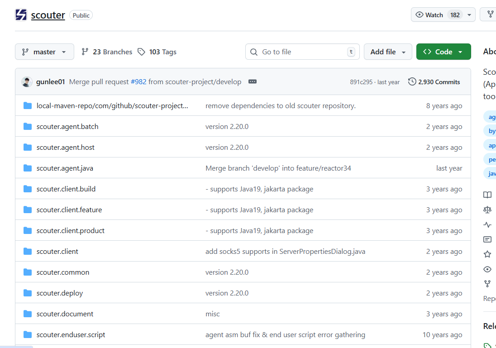
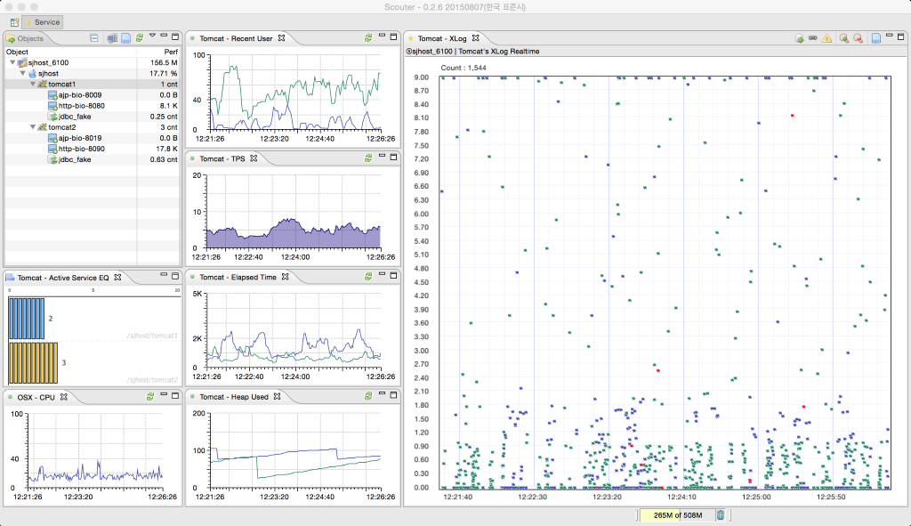

## 가비지 컬렉션 GC

간단하게 설명 하자면 Garbage Collection 은  Heap 영역에서 동적으로 할당했던 메모리 중 필요가 없어진, 사용이 완료된 메모리를 정리(제거)하는 역할을 합니다.

---

## GC 가 필요한가?

원래 C/C++에서는 개발자가 delete나 free()로 메모리를 직접 관리해야 합니다.
하지만 Java는 이 과정을 GC가 대신 처리합니다.

이 덕분에

- 메모리 해제 누락으로 인한 메모리 누수 감소
- 이미 해제된 메모리를 다시 해제하는 상황이 발생하지않음
- 개발자가 비즈니스 로직에 집중할 수 있어 개발 생산성 증가

라는 장점이 생깁니다.

---

## GC의 단점은 뭘까?

다 좋은데 GC 의 단점은 뭘까요?

GC는 ‘참조되지 않는 객체’를 식별하기 위해 전체 메모리를 스캔해야 합니다.
이 과정에서는 반드시 Stop-The-World(STW) 가 발생합니다.

> Stop-The-World 가 무엇이냐?
GC를 실행 하기 위해 애플리케이션 실행 을 잠깐 멈추고 GC를 실행 하는 순간
> 

즉, GC를 위해 프로그램이 “잠깐 멈추는 순간”이 있고,
이게 길어지면 실 서비스에서 **성능 저하**가 발생합니다.

또 하나의 단점은,

GC가 언제 발생할지 개발자가 정확히 예측하기 어렵다
→ 메모리 해제 타이밍을 직접 조정할 수 없다

입니다.

---

## Young, Old 영역

GC 에는 Young 과 Old 의 영역이 있습니다.
Young 영역에는 Eden 영역과 suvivor 0, suvivor 1 영역이 있습니다.

처음 객체를 생성하면 Eden영역에서 객체들이 생성되고 Eden영역에 객체가 가득 차면 suvivor 0 으로 넘어가게 됩니다.

> 이 과정을 minor GC 라고 불립니다.
> 

그 과정에서 age가 1이 오르고 suvivor 0에서 1로 넘어갈때도 age가 1씩 오릅니다. 이 과정에서 생존한 객체들은 0과 1을 반복 하며 왔다갔다 합니다.

그 과정에서 age는 계속 쌓이게 되고 age가 어느정도 찬다면 Old 영역에 올라가게 됩니다.

시간이 지나 프로그램이 실행이 되고 Old 영역에 실행중인 객체들이 하나둘씩 올라오면 Old 영역도 가득 차는 경우도 있겠죠?

> 이 과정을 Major GC 라고 불립니다.
> 

이 과정이 자주 발생 하게 된다면 반드시 정검을 해야합니다.

---

## 그렇다면 GC를 어떤 방식으로 확인 해야할까?

GC는 개발자가 보기 쉽게 백엔드 터미널 에 나오지 않고 내부적으로 돌아 갑니다. 이런 GC들을 그럼 어떻게 확인해야할까요?

### GC 모니터링

GC 모니터링이란 JVM이 어떻게 GC를 수행하고 있는지 알아내는 과정을 말합니다. 가령 Young 영역에 있던 객체를 Old 영역으로 언제 얼마나 이동했는지, stop-the-world가 언제 일어나고 얼마동안 일어났는지 등의 정보를 알 수 있습니다. GC를 모니터링하는 이유는 JVM이 효율적으로 GC를 수행하는지 파악하고 추가적인 GC 튜닝 작업이 필요한지 확인하기 위해서 입니다.

### Scouter

널널한 개발자 Tv 라는 유튜버 님의 영상을 찾아보니 Scouter라는 것을 활용하여 GC를 모니터링 한다고 한다.
Scouter는 오픈소스이며 무료 이다.

이런 식으로 실시간 대시보드, 트랜잭션 추적(TPS), SQL 처리 시간, JVM 가비지 콜렉션(GC) 및 힙메모리 사용량, OS 리소스(CPU, 메모리, 네트워크) 모니터링 등을 제공하는 모니터링 툴이다

나는 사용해보지 않았지만 나중에 사용해 보고 GC를 튜닝 해보고싶은 생각이 들어 찾아보았다. **GC를 모니터링하는** 과정은
결국 **내 프로그램이 어떻게 메모리를 사용하고 있는가** 를 확인하는 작업이고, 앞으로 실제 프로젝트에서도 **Scouter나 제니퍼** 같은 툴을 활용해서
GC 로그를 확인하고 직접 튜닝까지 경험해보고 싶다.