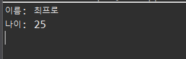
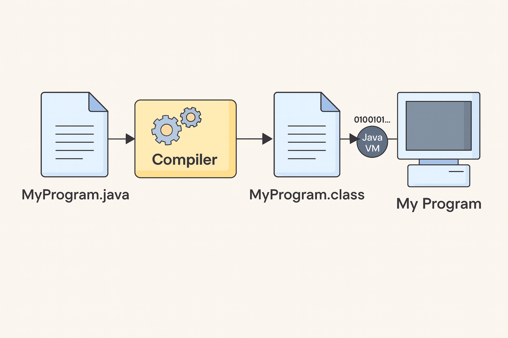
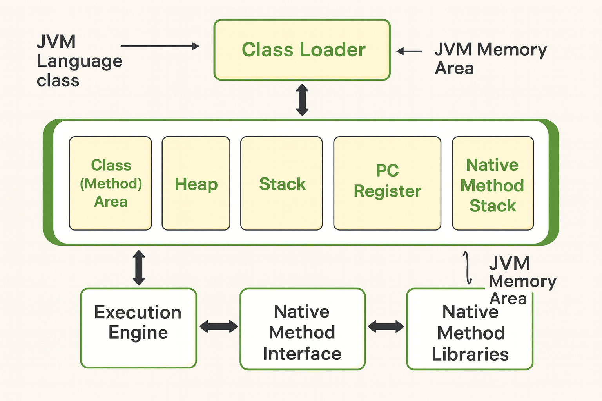
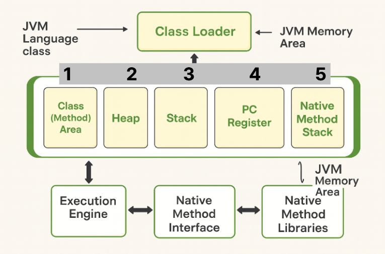
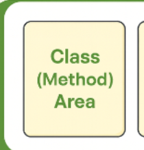
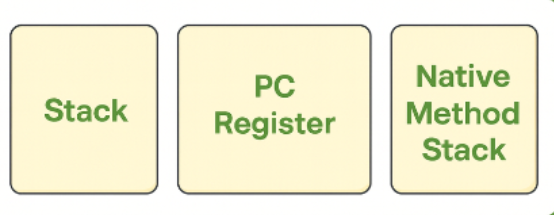
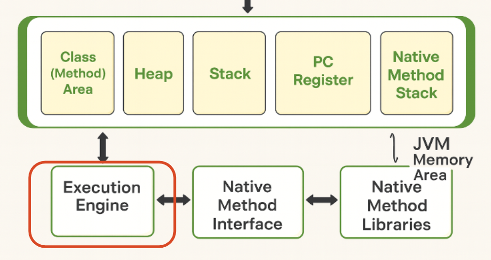

# JVM


## java

```java
public class Person {
    String name;
    int age;

    public Person(String name, int age) {
        this.name = name;
        this.age = age;
    }

    public void printInfo() {
        System.out.println("이름: " + name);
        System.out.println("나이: " + age);
    }
}

```

```java
public class Main {
    public static void main(String[] args) {

        Person p1 = new Person("최프로", 25);

        p1.printInfo();
    }
}

```

이 java 실행 하면 어떤 실행결과가 나오는지  아시나요??
다들 잘 아실꺼라고 생각합니다



> 근데 왜 이렇게 나올 수 있을 까요?
> 

어디에 저장이 되고 꺼내올수 있고 어디에서 출력이 되는걸까요

물론 저도 사실 JVM을 알기 전까지는 그냥 모르고 코드를 짜고 프로젝트를 완료 한 경험 도있습니다.
왜냐 그냥 몰라도 실행은 되고 기능구현이 되기 때문이에요.

> 하지만 이제라도 알아가면 되지않을까요?
> 

---

## Jvm은 뭘까

JVM의 정의는 Java Virtual Machine 의 줄임말로 어느 환경이던지 자바 프로그램을 실행 할 수 있도록 도와주는 프로그램입니다.

> 정의 를 들으면 음.. 자바 가상 머신이고 어느 환경이던지 자바 프로그램을 실행 할 수 있구나.
> 

끝입니다 사실 어느 환경에서든 자바프로그램을 실행 할 수 있는건 다들 아시잖아요 여기서 더 들어가면

---

## 컴파일 과정



자바는 컴파일 과정을 통해 **java 소스 코드를 class 바이트 코드로 변환**합니다.
class 바이트 코드로 변환하는 이유는 정의와 연관이 되어있는데요
먼저** C 언어는 컴파일 과정을 거치면 바로 기계어로 변환** 시켜 줍니다
하지만 **자바는 java 소스코드를 class바이트 코드로 변환**하고
JVM이 이 **바이트 코드들을 실제 기계어로 실행시점에 변환을 시켜줍**니다.

> 그럼 JVM이 안좋은것 아닌가요? 한번 더 변환 하는거 잖아요
> 

기계어는 CPU마다 기계어가 다릅니다. ntel, Apple ARM, AMD
이런 **CPU 마다 기계어가 각각 다르기** 때문에 C언어는 CPU마다 실행을 시켜주어야 한다는 뜻이죠

하지만 JVM 은 바이트 코드들을 가지고 있어 **실행 시점에 최적 기계어로 변환**을 시켜줍니다. 그래서 어떤 환경이든 JVM만 있으면 최적 기계어로 변환을 시켜주어 프로그램을 실행 시켜주는 것이죠

---

## JVM Memory Area



위와 같이 class 바이트 코드로 변환된 코드는 Class Loader를 통해서 JVM Memory Area 에 들어가게 됩니다.



JVM Memory Area에는 5개의 메모리 영역이 존재 하는데


Method Area와 Heap영역은 모든 스레드가 공유 하는 영역이고 나머지 는 스레드 마다 하나씩 생성되는 메모리 영역입니다 .



Method 영역은 JVM이 시작 될때 Static으로 선언한 변수, 클래스 정보, 변수 정보 등 저장이 되고 모든 스레드에 공유가 됩니다.


Heap영역은 동적으로 객체가 생성되면  Heap영역에 들어갑니다. 예를들어 new Person같은 new를 쓴 객체 를 생성하면 Heap영역에 들어갑니다.



그리고 Stack, PC Register, Native Method Stack 은 차례대로

Stack: 지역변수, 매서드 매개변수 등 임시적으로 사용되는 변수 같은 금방 사용되고 끝나는 것을 저장하는 영역입니다.

PC Register: 스레드가 시작될때 생성되며 현재 수행중인 JVM의 명령어 주소를 저장하는 공간입니다.

Native Method Stack: 자바 외 언어로 작성된 네이티브 코드들을 위한 메모리 영역입니다.

---

## 실행 영역



JVM 메모리 영역에 로드가 완료 되면, 실행 엔진이 자바 바이트 코드를 실행 시켜 기계어로 변환 시킵니다.

그 다음 Native Method Interface를 통해 java 언어 자체로 해결이 안되는  C나 C++과 같은 함수들을 실행 시킵니다.

---

### 그럼 아까 작성한 코드가 JVM에서 어떻게 실행될까요?

```java
Person p1 = new Person("최프로", 25);
p1.printInfo();

```

1. 클래스 로딩

Person.class가 Class Loader → Method Area에 로드됨.
(클래스 정보, 메서드 정보 저장)

1. 객체 생성

new Person(...) 실행 → Heap 영역에 실제 객체 생성

1. 참조 변수 저장
`Person p1`

p1 변수는 Stack 영역에 저장되고,
Heap에 있는 Person 객체의 주소(참조값) 를 보관함.

1. 메서드 실행

p1.printInfo() 호출 시

Stack의 `p1` → Heap 객체 접근

Method Area에서 `printInfo()` 메서드 정보 찾기

실행 엔진이 메서드 실행

출력 결과:

```
이름: 최프로
나이: 25

```

---

## 마무리

자바의 실행시에는 간단하게 new를 써 변수에 객체를 저장하고 그 객체에서 메서드를 쓰면 된다. 로 끝나는 것이 아니라
뒤에서는 클래스를 로드하고, Heap과 Stack에 메모리를 배치하고,
실행 엔진이 바이트코드를 기계어로 변환하며 프로그램을 움직이고 있는것이죠.

우리의 단순한 코드도  JVM 내부에서 여러가지 처리가 이루어 진다는 것을 알고있고 이러한 이해가 쌓이면 java개발자가 되는것 같습니다. 저도 이 글을 쓰며 더 많이 알아가게 되었고 정리가 되었던 시간인것 같습니다. 글 읽어주셔서 감사합니다.