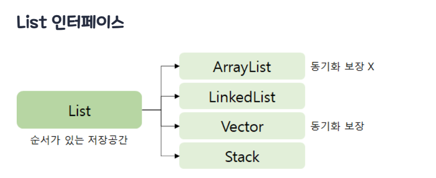
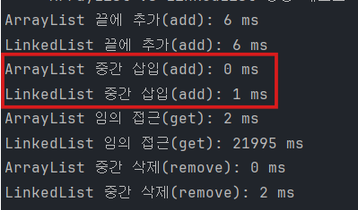

## 실험 동기

자바의 Collection Framework 를 찾아보던 중 list 인터페이스에
ArrayList와 LinkedList를 발견하였다.

[참고 블로그 inpa 티스토리](https://inpa.tistory.com/entry/JCF-%F0%9F%A7%B1-Collections-Framework-%EC%A2%85%EB%A5%98-%EC%B4%9D%EC%A0%95%EB%A6%AC)



### ArrayList 특징


> 삽입/ 삭제가 느림
> 

LinkedList 특징


삽입삭제가 빈번할 경우 빠른 성능

---

### 결과



> 엥?
> 

**ArrayList가 중간삽입에서 더 빠르다** 심지어 get 상황에서는 **10,000 배 이상** ArrayList가 빨랐다.

우선 테스트 코드는 GPT에게 짜달라했고 다음과 같다

```java
public class Main {
    public static void main(String[] args) {

        // ===== ArrayList 와 LinkedList 성능 비교 테스트 =====

        int TEST_SIZE = 200000; // 테스트 데이터 개수 (20만)
        int MID_INDEX = TEST_SIZE / 2;

        java.util.List<Integer> arrayList = new java.util.ArrayList<>();
        java.util.List<Integer> linkedList = new java.util.LinkedList<>();

        System.out.println("==== ArrayList vs LinkedList 성능 테스트 시작 ====");

        // ----------------------------------------------------
        // 1. 리스트 끝에 요소 추가 (add)
        // ----------------------------------------------------
        long start = System.currentTimeMillis();
        for (int i = 0; i < TEST_SIZE; i++) arrayList.add(i);
        long end = System.currentTimeMillis();
        System.out.println("ArrayList 끝에 추가(add): " + (end - start) + " ms");

        start = System.currentTimeMillis();
        for (int i = 0; i < TEST_SIZE; i++) linkedList.add(i);
        end = System.currentTimeMillis();
        System.out.println("LinkedList 끝에 추가(add): " + (end - start) + " ms");

        // ----------------------------------------------------
        // 2. 리스트 중간에 요소 삽입
        // ----------------------------------------------------
        start = System.currentTimeMillis();
        arrayList.add(MID_INDEX, -1);
        end = System.currentTimeMillis();
        System.out.println("ArrayList 중간 삽입(add): " + (end - start) + " ms");

        start = System.currentTimeMillis();
        linkedList.add(MID_INDEX, -1);
        end = System.currentTimeMillis();
        System.out.println("LinkedList 중간 삽입(add): " + (end - start) + " ms");

        // ----------------------------------------------------
        // 3. 임의 접근(get)
        // ----------------------------------------------------
        start = System.currentTimeMillis();
        for (int i = 0; i < TEST_SIZE; i++) arrayList.get(i);
        end = System.currentTimeMillis();
        System.out.println("ArrayList 임의 접근(get): " + (end - start) + " ms");

        start = System.currentTimeMillis();
        for (int i = 0; i < TEST_SIZE; i++) linkedList.get(i);
        end = System.currentTimeMillis();
        System.out.println("LinkedList 임의 접근(get): " + (end - start) + " ms");

        // ----------------------------------------------------
        // 4. 중간 요소 삭제(remove)
        // ----------------------------------------------------
        start = System.currentTimeMillis();
        arrayList.remove(MID_INDEX);
        end = System.currentTimeMillis();
        System.out.println("ArrayList 중간 삭제(remove): " + (end - start) + " ms");

        start = System.currentTimeMillis();
        linkedList.remove(MID_INDEX);
        end = System.currentTimeMillis();
        System.out.println("LinkedList 중간 삭제(remove): " + (end - start) + " ms");

        System.out.println("==== 테스트 종료 ====");
    }
}

```

---

## 왜?

왜그럴까?
분명 LinkedList는 삽입과 삭제가 빠르다고 배웠는데..

> ArrayList의 중간 삽입이 이론과 달리 빨랐던 결정적인 이유는 내부 구현 방식에 있었다.
> 

보통 배열 중간에 요소를 추가하려면, 뒤에 있는 데이터들을 반복문(for)을 돌려 한 칸씩 뒤로 밀어내야 한다고 생각한다.

```java
// 일반적으로 생각하는 방식
private void shiftRightFrom(int index) {
    for (int i = size; i > index; i--) {
        elementData[i] = elementData[i - 1]; //인덱스 를 한칸씩 뒤로 밀어냄
    }
}

```

만약 자바가 위와 같이 구현되어 있었다면 시간 복잡도 $O(N)$의 영향으로 속도가 매우 느렸을 것이다. 하지만 실제 JDK의 ArrayList 코드를 확인해보니 달랐다.

```java
// 실제 ArrayList 구현
public void add(int index, E element) {
    rangeCheckForAdd(index);
    // ... (중략) ...

    System.arraycopy(elementData, index,
                     elementData, index + 1,
                     s - index);

    elementData[index] = element;
    size = s + 1;
}

```

여기서 사용된 `System.arraycopy()` 가 핵심이다. 이 메서드는 자바 언어 차원에서 반복문을 도는 것이 아니라, 메모리 블록을 통째로 복사해서 이동시킨다. 덕분에 대량의 데이터를 이동시켜야 하는 작업임에도 불구하고 처리 속도가 빨랐던 것이다.

---

### 결론

### 1. 중간 삽입도 ArrayList가 더 빠르다

이론적으로 ArrayList 의 중간삽입은 O(n)의 시간 복잡도를 가져서 성능 저하가 예상됐지만, 내부적으로 System.arraycopy를 사용하여 메모리를 고속 복사를 하고있어 실제 테스트 에서는 LinkedList보다 더 효율적인 성능 을 보였다.

### 2. LinkedList가 더 유리한 구조는?

LinkedList가 구조적으로 이점을 가지는 경우는 데이터를 앞에서 삭제하고 뒤에서 삽입 하는 **선입 선출** 상황인것 같다. ArrayList 는 0번 인덱스를 삭제할 경우 이후의 모든 데이터를 앞으로 이동시켜야함.

> 근데 선입 선출 목적이라면 Queue인터페이스를 사용하는것이 더 좋은것같은 생각이다.
>