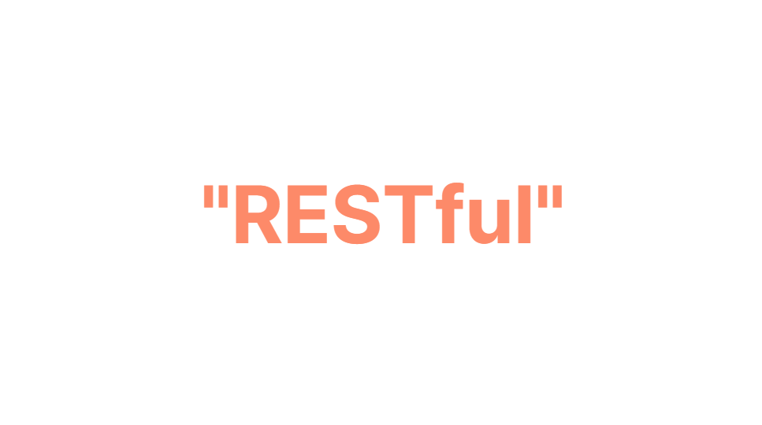
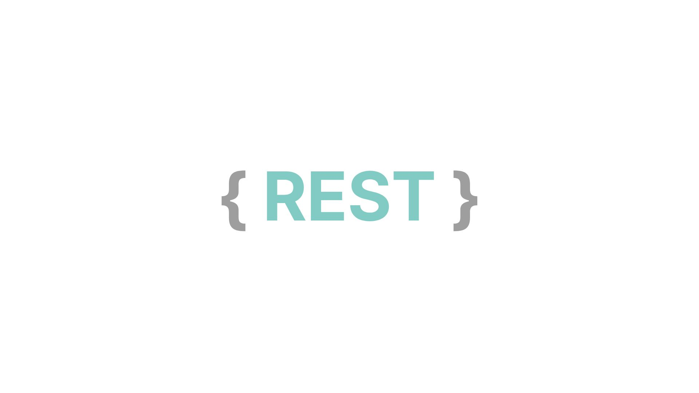
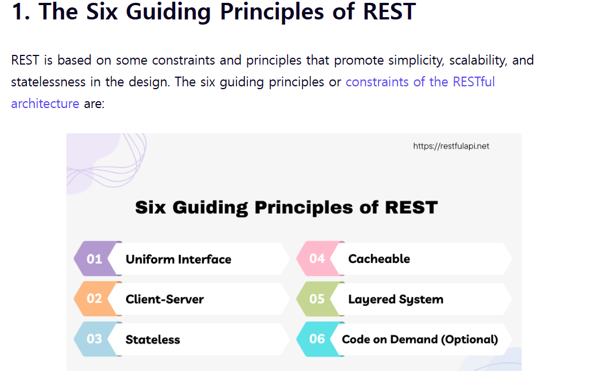
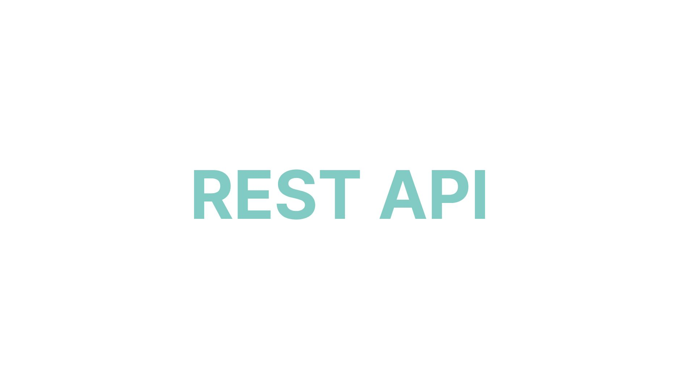

## 들어가며
REST API, Restful 이런 단어를 개발하다보면 무조건 듣게 되어있습니다. Restful 한 설계가 뭔지, Restful한 설계를 하면 뭐가좋은지 정리 하였습니다.

## REST

**REST** 는 뭘까요? **REST(Representational State Transfer)**는 자원을 이름(URI)으로 구분하여 해당 자원의 상태(State)를 주고받는 모든 것을 의미합니다. 월드 와이드 웹(WWW)의 기존 기술과 HTTP 프로토콜을 그대로 활용하여 웹의 장점을 극대화하기 위해 제안된 아키텍처 스타일입니다.

### REST의 구성 요소 3가지
**1. 자원 (Resource): URI**

모든 자원에는 고유한 ID가 있으며, 이를 URI(Uniform Resource Identifier)로 명시합니다.

예) `/members/1`

**2. 행위 (Verb): HTTP Method**

자원에 대한 행위는 HTTP Method(GET, POST, PUT, DELETE 등)로 정의합니다.

예) GET(조회), DELETE(삭제)

**3. 표현 (Representation)**

클라이언트와 서버가 데이터를 주고받는 자원의 형태를 의미합니다.

예) JSON, XML

---
## REST 설계원칙 6가지 

REST 설게원칙 6가지는 위의 공식문서에서 보면 좋을것 같습니다.

1. 균일한 인터페이스
2. 클라이언트-서버
3. 무상태(Stateless)
4. 캐시 가능
5. 계층형 시스템
6. 주문형 코드 생성

## REST API/ RESTful?

그럼 REST API 가 뭘까요?  REST API 는 REST 설계원칙을 준수 하는 API입니다. 

그럼 RESTful은 뭘까요? RESTful이란 REST의 원리를 따르는 시스템을 의미합니다.

하지만 REST를 사용했다고 해서 모두가 RESTful 한 것은 아닙니다. REST API의 설계 규칙을 올바르게 지킨 시스템만이 비로소 RESTful하다고 할 수 있습니다.

- RESTful 하지 못한 경우 모든 CRUD 기능을 POST로만 처리하거나, URI에 동사를 섞어 쓰는 등 규칙을 어긴 API는 REST를 사용했더라도 RESTful 하지 못한 시스템입니다.

- RESTful 한 경우 URI는 자원을 표현하는 데에 집중하고, 행위는 HTTP Method로 명확히 정의하는 등 설계 규칙을 잘 준수한 시스템을 말합니다.

즉 제가 이해한 바로는 REST 방식을 잘 준수 하여 작성한 REST 방식을 RESTful이라고 불리는것이라고 생각합니다.

---

## REST API URI 설계 규칙
RESTful한 API를 만들기 위해 실무에서 주로 사용하는 5가지 URI 설계 규칙입니다.

### 1. URI의 마지막에는 슬래시(/)를 포함하지 않는다.
슬래시 구분자(/)는 계층 관계를 나타내는 데 사용합니다. URI 끝에 슬래시를 붙이면, 해당 경로가 '디렉토리'임을 암시할 수 있어 혼동을 줄 수 있습니다. 명확한 자원 표현을 위해 마지막 슬래시를 제거합니다.

* **Bad**
    `http://api.test.com/users/`
* **Good**
    `http://api.test.com/users`

### 2. 밑줄(_) 대신 하이픈(-)을 사용한다.
가독성을 위해 긴 단어의 조합은 하이픈(-)으로 구분합니다. 밑줄(_)은 보기 어렵거나 문자가 가려질 수 있어 사용하지 않습니다. 정확한 의미나 표현을 위해 단어의 결합이 불가피한 경우 반드시 하이픈을 사용합니다.

* **Bad**
    `http://api.test.com/users/post_comments`
* **Good**
    `http://api.test.com/users/post-comments`

### 3. URI는 소문자를 사용한다.
RFC 3986(URI 문법)에 따르면 URI 스키마와 호스트를 제외하고는 대소문자를 구별합니다. 혼란을 방지하기 위해 URI 경로는 항상 소문자로 작성하는 것이 원칙입니다.

* **Bad**
    `http://api.test.com/users/postComments`
* **Good**
    `http://api.test.com/users/post-comments`

### 4. 행위(Method)는 URI에 포함하지 않는다.
가장 많이 범하는 실수입니다. 행위는 오직 HTTP Method(GET, POST, DELETE 등)로만 표현해야 하며 URI에 delete, insert 등의 동사가 들어가면 안 됩니다.

* **Bad**
    `POST http://api.test.com/users/1/delete-post/1`
* **Good**
    `DELETE http://api.test.com/users/1/posts/1`

### 5. 컨트롤 자원(Control Resource)은 예외적으로 동사를 허용한다.
일반적인 CRUD로 표현하기 어려운 동작(함수 실행, 프로세스 시작 등)을 수행하는 리소스를 컨트롤 자원이라고 합니다. 이 경우에만 예외적으로 URL에 동사를 사용하여 동작을 명확히 할 수 있습니다.

* **Bad**
    `http://api.test.com/posts/duplicating`
* **Good**
    `http://api.test.com/posts/duplicate`

---

### 마무리 

이번 포스팅을 통해 막연하게만 알고 있던 REST와 RESTful의 개념을 명확히 정리할 수 있었습니다.

학습하기 전에는 단순히 "데이터만 잘 주고받으면 되는 것 아닌가?"라고 생각했었습니다. 하지만 RESTful한 설계란 결국 기술적인 제약을 넘어, **"API 문서를 굳이 보지 않아도 URI만 보고 직관적으로 의미를 파악할 수 있게 만드는 개발자 간의 약속"**이라는 점을 깨닫게 되었습니다.

잘 설계된 URI 규칙 하나가 협업 시 커뮤니케이션 비용을 얼마나 줄여줄 수 있는지 알게 된 만큼, 앞으로 프로젝트를 진행할 때 오늘 정리한 설계 규칙들을 의식적으로 적용해 보며 RESTful한 API를 만드는 습관을 들여야 할 것 같습니다.

