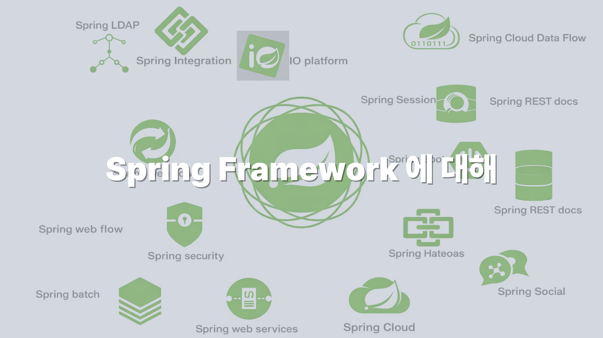
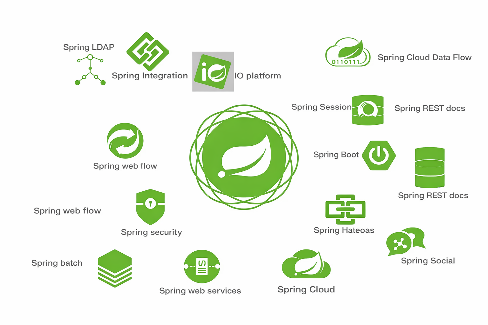
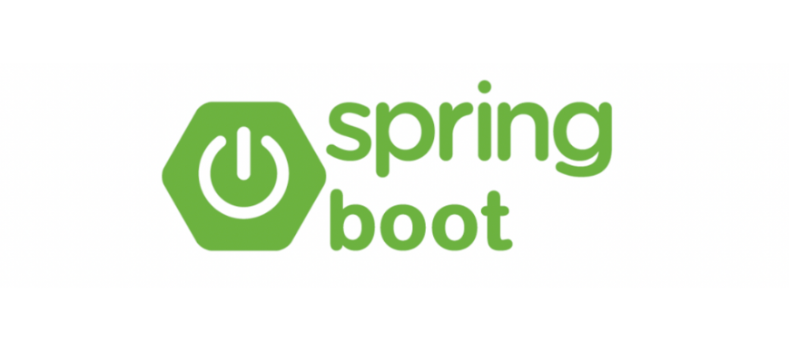
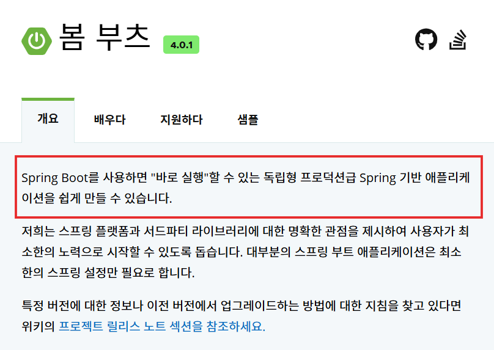

## 들어가면서 
현재 Spring boot 를 사용하여 개발을 하고있지만 spring framework 에 대해 알아보지 못했다. 그냥 뭐 controller 로 요청을 받고 serive에서 비즈니스 로직을 작성하고 bean 에 객체가 저장 되고 이런건 알지만 "Spring Framework"에 대한 정의를 모르기도 했고 Spring과 Spring Boot 에 대한 차이도 이해하지 못했기도 해서 정리 한 글이다. 

## Spring Framework 란
스프링 프레임워크는 자바 엔터프라이즈 애플리케이션 개발을 위한 오픈소스 프레임워크다. 

장점은
- 자바기반의 어플리케이션을 만들 수 있다.
- 개발자들은 비지니스 로직에 집중을할 수 있다.
등 이 있다.

---
## EJB
스프링 이전엔 EJB 프라임워크가 있었다. 

EJB는 2000년대 초반에 등장했고 

목적은 비지니스 로직과 앤터프라이즈 기술의 분리가 목적이였고 이로 인해 
편리한 애플리케이션 개발을 하자는 목적이있었다. 

**편리한 개발**이란 개발자가 복잡하고 실수하기 쉬운 로우레벨의 기술에 신경쓰지 않고도, 애플리케이션의 핵심인 사용자의 요구사항, 비지니스 로직을 빠르고 효과적으로 구현하는것이다. 

> 좋다. 근데 왜 안쓸까?

- 너무 비싸다
EJB의 혜택을 얻기 위해 모든 기능이 필요하지도 않은 고가의 WAS 를 구입해야했었다. 그리고 고급 IDE의 도움없이는 손쉽게 다룰 수 없는 복잡한 설정 파일이 필요했다. 

- 비즈니스 로직보다 EJB를 사용하기 위한 코드가 너무 많음 
EJB 프레임워크를 따르려면 비지니스로직보다 EJB를 사용하기 위한 코드가 더 많았고, 그로인해 EJB에 너무 의존적이고 종속적인 개발을 하게되었다.

> 의존적이고 종속적인 개발 -> 기존 JAVA의 장점을 못살림.

---
## Spring 등장

2002년 로드 존슨이 기존 EJB의 문제점을 비판하며 고품질 애플리케이션의 가능성을 증명하기 위해 선보인 3만 라인의 예제 코드는, BeanFactory와 ApplicationContext를 비롯해 POJO, IoC, DI 등 현재 스프링 프레임워크를 지탱하는 핵심 개념들이 모두 집약된 역사적인 시작점이었다.

> EJB의 복잡한 겨울을 지나 개발의 봄을 맞이한다는 의미를 담고있다.

---
## Spring 이란? 

#### 1. 거대한 생태계 (Ecosystem)
사실 우리가 흔히 스프링을 쓴다고 할 때, 이는 단순히 스프링 프레임워크(Spring Framework) 하나만 지칭하는 것이 아니다.

스프링은 프레임워크를 중심으로 하여, 설정을 자동화해주는 **스프링 부트(Spring Boot)**와 함께 다음의 다양한 프로젝트들이 유기적으로 결합된 거대한 생태계를 형성하고 있다.

- 스프링 데이터 (Spring Data)

- 스프링 세션 (Spring Session)

- 스프링 시큐리티 (Spring Security)

- 스프링 RestDocs

- 스프링 배치 (Spring Batch)

- 스프링 클라우드 (Spring Cloud)

---

#### 2. 핵심 철학 : POJO
로드 존슨이 제안한 코드의 핵심이자 스프링의 본질은 **POJO(Plain Old Java Object)** 프로그래밍을 지향한다는 점이다.

EJB 시절에는 비즈니스 로직을 짜기 위해 `extends EJBContext` 처럼 특정 프레임워크의 클래스를 상속받아야 했다. 즉, 내 코드가 프레임워크에 종속되는 구조였다.

하지만 스프링은 다음과 같은 철학을 가진다.

> "가장 순수한 자바 객체(POJO)로 돌아가자"

특정 기술이나 환경에 종속되지 않고, 평범한 자바 객체만으로 엔터프라이즈 기능을 구현할 수 있게 해주는 것이다.

#### 3. 3대 핵심 기술 (Spring Triangle)
`POJO` 프로그래밍을 가능하게 만드는 것이 바로 스프링의 3대 핵심 기술, 일명 `Spring Triangle`이다.

#### IoC / DI (제어의 역전 / 의존성 주입)

객체의 생성과 연결을 개발자가 아닌 스프링 컨테이너가 대신 관리하여 유연성을 확보한다.

#### AOP (관점 지향 프로그래밍)

로깅, 트랜잭션 같은 공통 기능을 핵심 로직에서 분리해낸다.

#### PSA (일관된 서비스 추상화)

JDBC, JPA 등 백엔드 기술이 바뀌어도 코드를 뜯어고치지 않도록 표준화된 인터페이스를 제공한다.

---

## Spring boot의 등장

점점 커져가는 스프링 생태계와 스프링 프레임워크 의 기능들이 더해지고 외부 라이브러리를 함께 사용할 일이 많아졌고 

그래서 등장한것이 **스프링 부트**이다.

스프링 부트의 공식홈페이지에 "스프링 부트를 사용하면 스프링 기반의 어플리케이션을 쉽게 만들 수 있다." 라고 나와있다. 

복잡할 설정 없이 즉시 애플리케이션 개발시작이 가능한것이다. 

---
## 왜 Spring Boot 인가? 

그렇다면 왜 사람들은 기존 **Spring Framework만 사용하는 방식**을 힘들어했고,  
**Spring Boot**에 열광하게 되었을까?  
크게 두 가지 이유가 있다.

---

### 배포 과정의 복잡함 (WAS와 WAR)

스프링 부트가 없던 시절,  
웹 애플리케이션 하나를 띄우는 과정은 상당히 번거로웠다.

### 기존 Spring의 배포 과정

1. 서버에 **Tomcat 같은 WAS(Web Application Server)**를 별도로 설치한다.  
2. 개발한 코드를 **WAR(Web Application Archive)** 파일로 빌드한다.  
3. 빌드된 WAR 파일을 WAS가 설치된 폴더 하위(`webapps`)에 넣는다.  
4. WAS를 실행시킨다.

개발하기도 바쁜데,  
서버 설정하고, 톰캣 깔고, 버전 맞추고…  
**배포 과정 자체가 하나의 일이었다.**

### Spring Boot의 해결책

스프링 부트는 **내장 톰캣(Embedded Tomcat)**을 기본으로 포함하고 있다.

- 별도의 톰캣 설치 불필요
- 코드를 **JAR(Java Archive)** 파일로 빌드
- `main()` 메서드 실행하듯 실행하면 웹 서버가 바로 기동

즉,  
**애플리케이션 실행 = 서버 실행** 이 가능해졌다.

---

### 의존성 관리의 어려움 

두 번째 이유는 **라이브러리 의존성 관리**였다.

프로젝트를 하다 보면  
DB 연결, JSON 변환, 보안 등 수많은 외부 라이브러리를 사용하게 되는데,  
이 라이브러리들의 **버전**을 맞추는 일이 매우 까다로웠다.

#### 기존 Spring의 문제

>“스프링 4.x를 쓰는데, 여기에 맞는 Jackson 버전은 뭐지?”
> “MyBatis는 몇 버전을 써야 에러가 안 나지?”

개발자가 직접 구글링해서  
호환되는 라이브러리 버전을 찾고  
`pom.xml`이나 `build.gradle`에 하나하나 명시해야 했다.

버전 하나만 잘못 맞춰도  
**서버가 아예 실행되지 않는 경우도 흔했다.**

#### Spring Boot의 해결책

스프링 부트는 **starter**라는 의존성 관리 방식을 제공한다.

- **버전 관리 자동화**  
  `spring-boot-starter`를 사용하면  
  스프링 부트 버전에 맞는 라이브러리 조합을 자동으로 설정  
  → 개발자가 라이브러리 버전을 직접 명시할 필요 없음

- **Starter 묶음 제공**  
  `spring-boot-starter-web` 하나만 추가하면  
  - 내장 톰캣  
  - Spring MVC  
  - Jackson(JSON 변환)  
  등 웹 개발에 필요한 라이브러리가 한 번에 포함된다.

---
## 마치며
글을 작성하기 전까지 나는 그저 인터넷 예제를 따라 `Controller`를 만들고 `Service`를 호출하면서, 원래 이렇게 하는 거니까라는 생각으로 기계적인 개발을 해왔다.

하지만 이번 정리를 통해 `Spring`과 `Spring Boot`가 단순한 개발 도구가 아니라, 개발자의 생산성을 높이고 유지보수하기 좋은 코드를 만들기 위해 발전해 온 기술이라는 것을 이해하게 되었다.

내가 학습한 내용을 요약하자면 다음과 같다.

### 1. Spring Framework의 본질
`Spring`은 과거 `EJB`의 복잡하고 특정 기술에 종속적인 개발 방식에서 벗어나, **순수한 자바 객체(POJO)**만으로도 엔터프라이즈급 개발이 가능하도록 만들어주었다. 덕분에 개발자는 기술적인 복잡함보다는 핵심 비즈니스 로직 구현에 집중할 수 있게 되었다.

### 2. Spring Boot의 역할
`Spring Boot`는 방대해진 `Spring` 생태계를 복잡한 초기 설정 없이 즉시 사용할 수 있도록 돕는다. 내장 톰캣을 통해 배포 과정을 단축시키고, `Starter`를 통해 라이브러리 의존성을 자동화함으로써 **"환경 설정"**에 들어가는 시간을 줄여주었다.

결국 **Spring은 "객체 지향적인 설계를 돕는 기반"**이고, **Spring Boot는 "그 기반을 쉽고 빠르게 사용할 수 있게 해주는 도구"**라고 정리할 수 있다.