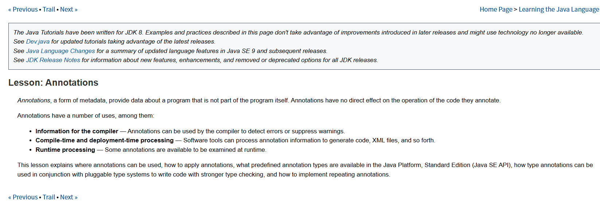
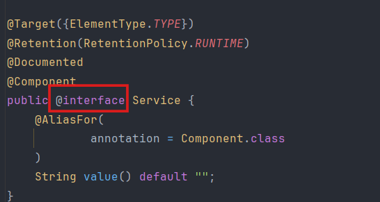
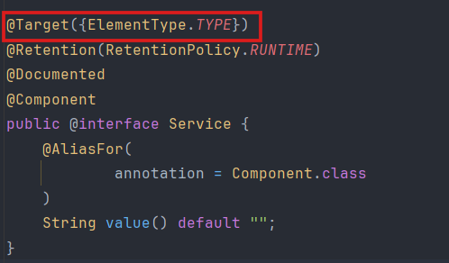
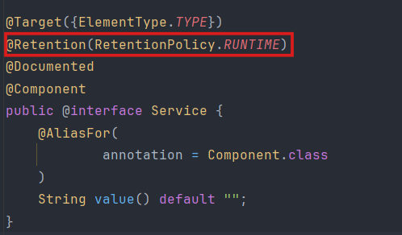
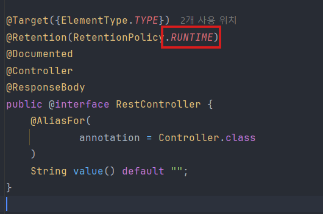

## 어노테이션 
이젠 스프링 에서 습관적으로 controller 로직위엔 `@Controller`, get 요청 위엔 `@GetMappting`, getter, setter 위엔 `@Getter`, `@Setter` 를 붙이곤 한다. 근데 이걸 왜쓸까요?

## 초기 
스프링 프레임워크 초기에는 클래스를 Bean으로 등록하거나 설정할 때 주로 XML 설정 파일을 사용했다.
Bean에 대한 글은 아래에 간단히 정리 되어있습니다.
-> [Spring Bean?](https://velog.io/@dreamdp01/Spring-Bean)

```xml
<?xml version="1.0" encoding="UTF-8"?>
<beans xmlns="http://www.springframework.org/schema/beans"
       xmlns:xsi="http://www.w3.org/2001/XMLSchema-instance"
       xsi:schemaLocation="http://www.springframework.org/schema/beans
                           http://www.springframework.org/schema/beans/spring-beans.xsd">

    <bean id="userRepository" class="com.example.demo.UserRepository" /> <!--이런식으로-->

    <bean id="userService" class="com.example.demo.UserService">
        <property name="userRepository" ref="userRepository" />
    </bean> <!--요런식으로-->

</beans>
```
이렇게 Xml 파일에 Repository와 Service를 bean에 등록한후 실행할때는 

```java
public class Main {
    public static void main(String[] args) {
        // XML 파일 읽어와서 스프링 컨테이너 생성시킴
        ApplicationContext context = new GenericXmlApplicationContext("applicationContext.xml");

        // 컨테이너에서 빈을 가져와서 써야함 
        UserService userService = context.getBean("userService", UserService.class);
        userService.register();
    }
}
```

>뭐야 간단하네 Xml 로 써도 되겠는데?

만약 `Repository`와 `Service` 가 50개 정도 더 많아지면 어떻게 해야할까요 파일양이 방대해지지 않을까요? 그리고 이름을 살짝이라도 바꾸면 `xml`파일을 비롯해서 `repsitory`, `service` 로직도 바뀌게 됩니다. 

결국 소스코드와 설정파일이 물리적으로 분리되어있어 관리할곳이 늘어나고 유지보수가 어려워져 이를 보안하기 위해 **어노테이션이** 도입 됩니다.

---
## 어노테이션이란

#### 출처 오라클 공식 홈페이지 



한글로 번역해보면 다음과 같습니다.
>**어노테이션**은 **메타데이터**의 한 형태로, 프로그램 자체의 일부가 아닌 프로그램에 대한 정보를 제공합니다. 어노테이션은 어노테이션이 적용된** 코드의 동작에 직접적인 영향을 미치지 않습니다**.

즉 어노테이션은 **메타데이터**의 일종입니다. **메타데이터란** 데이터에 대한 데이터를 의미하고, 소스코드의 로직 자체를 변경하지 않으면서 해당 코드가 컴파일되거나 실행될 때 어떻게 처리되어야 하는지 알려주는 정보를 제공합니다.

---
## 어떻게 동작하는것일까?
코드 동작에 직접 영향을 주지 않는다는 어노테이션이 어떻게 실제 기능을 수행하는지 이해하려면 처리 주체를 알아야 합니다. 어노테이션이 실제 동작으로 이어지는 과정은 크게 세 단계로 나뉩니다. 

#### 어노테이션 정의 

@Service 어노테이션 내부

어노테이션 내부를 보면 @interface로 정의되어 있으며, 여기에 유지 범위(@Retention)와 적용 대상(@Target)이 명시되어 있습니다.

#### 클래스 스캐닝 
프로그램이 런타임 또는 컴파일 타임에 특정 엔진이 클래스들을 훑으며 어노테이션이 붙은 대상을 찾습니다.

**Spring**의 경우: `@ComponentScan` 설정에 따라 지정된 패키지 내의 모든 클래스를 검사하여 `@Component`, `@Service`, `@Controller` 등이 붙은 클래스를 식별합니다.

#### 리플렉션을 통한 정보 추출
이것이 가장 핵심적인 동작 원리입니다. 자바의 리플렉션 API를 사용하면 실행 중인 프로그램이 자신의 클래스, 메서드, 필드 정보를 조회할 수 있습니다.

리플렉션이란? 
>실행 중인 자바 애플리케이션이 자신의 구조를 분석하고 내부 정보를 수정할 수 있게 하는 **자바 API**입니다. 구체적으로는 `클래스`, `인터페이스`, `메서드`, 필드의 정보를 동적으로 읽어오거나 조작하는 기술을 의미합니다.

런타임 시점: 스프링 컨테이너가 리플렉션을 통해 특정 클래스에 붙은 어노테이션 정보를 읽어옵니다.

조건부 로직 실행: "만약 @Service가 붙어 있다면 객체를 생성해서 빈 컨테이너에 등록하라"는 내부 로직이 실행됩니다.

기능 수행: 어노테이션 자체는 정적인 주석일 뿐이지만, 이를 읽어 들이는 프레임워크나 JVM이 해당 정보를 근거로 특정 동작을 대신 수행해 주는 것입니다.

---

## 메타 어노테이션 (Meta-Annotations)
어노테이션을 정의하기 위한 어노테이션으로, 주로 `@interface` 정의 시 상단에 선언합니다.


| 어노테이션 | 설명 |
| :--- | :--- |
| **@Target** | 어노테이션을 적용할 수 있는 대상(위치)을 지정함. (예: FIELD, METHOD, TYPE) |
| **@Retention** | 어노테이션의 정보가 유지되는 범위를 지정함. (SOURCE, CLASS, RUNTIME) |
| **@Documented** | 해당 어노테이션 정보가 Javadoc 등 문서 생성 시 포함되도록 함. |
| **@Inherited** | 어노테이션이 자식 클래스에게도 상속되도록 지정함. |
| **@Repeatable** | 동일한 어노테이션을 하나의 대상에 여러 번 중복해서 적용할 수 있게 함. |

이 중에 어노테이션이 언제, 어디서 처리되는지 정하는 Target과 Retention에 대해 알아 볼것입니다

---
## @Target과 @Retention

#### @Target 
어노테이션을 어디에 붙일 수 있는지 제한합니다.



- **ANNOTATION_TYPE**: 어노테이션 정의 시 사용
- **METHOD**: 메서드에 사용
- **FIELD**: 필드(멤버 변수)에 사용
- **TYPE**: 클래스, 인터페이스에 사용

#### @Retention 
어노테이션이 어느 시점까지 살아있을지를 결정합니다. 이 설정에 따라 처리 방식이 완전히 달라집니다.



- **SOURCE** 타입: 컴파일 전까지만 유효함. 컴파일 후에는 사라짐.

 >예: @Override (컴파일러가 확인 후 제거), Lombok의 @Getter/@Setter (컴파일 시점에 코드를 생성하고 사라짐).


- **CLASS** 타입: 클래스 파일까지는 남아있지만, 런타임(실행 시점)에는 참조할 수 없음. 


- **RUNTIME** 타입: 실행 중에도 메모리에 정보가 유지됨.

 >예: @Component, @Autowired 등 스프링 핵심 설정.
 


스프링은 리플렉션을 통해 런타임에 이 정보를 읽어 빈을 관리하고 의존성을 주입합니다.

---
5. 결론
어노테이션은 단순히 소스코드에 의미를 부여하는 **표식**입니다. 이 표식을 보고 실제 객체를 생성하거나 의존성을 연결해 주는 것은 **스프링 프레임워크의 런타임 프로세스인 리플렉션**입니다.

코드와 설정을 한곳에서 관리할 수 있게 됨으로써 유지보수성은 높아졌지만, 개발자라면  내부적으로 리플렉션이라는 복잡한 메커니즘을 통해 동작하고 있다는 점을 인지해야 된다고 생각합니다.