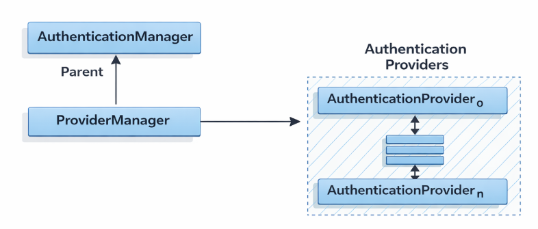
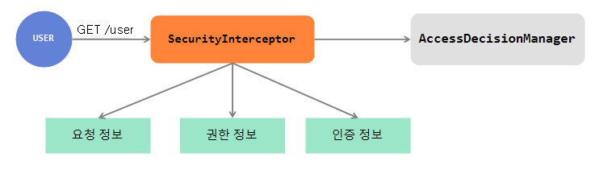

### 들어가면서 
인증과 인가는 무엇일까요 같은걸까요 다른걸까요 
인증과 인가는 어디에서 처리 할까요 `PUT /board/{id}` 예시로 간단하게 정리 해봤습니다.

# 인증과 인가는 뭘까요?

### 인증(Authentication)
식별 가능한 정보로 서비스에 등록된 유저의 신원을 입증 하는 과정 입니다

>**예를 들어** 
> 회사의 사원증이라고 보면 됩니다. 내 사원증으로 다른 회사는 들어갈 수 없겠죠??

인증은 주로 세션과 JWT같은 토큰을 사용합니다

### 인가(Authorization)
인증이 완료된 사용자에 대한 자원 접근 권한을 확인하는 과정입니다.
>**예를 들어**
> 회사의 자사 웹사이트가 있다고 치면 직원 누구나 개발 코드를 접근 할 수 있으면 안되겠죠? 개발자만 접근할 수 있도록 권환을 확인해야합니다

---
## PUT "/board/{id}"
그럼 실제 API요청에서 인증과 인가는 어떤 순서로 적용될까요? 
`PUT /board/{id}` 이 요청을 보면 짐작 하자면 `PUT` 요청이고 게시판에 대한 요청이라고 짐작할 수 있습니다 

메서드는 간단하게 `GET`,`POST`,`PUT`,`PATCH`,`DELETE` 가 있고 다음과 같습니다

>GET: 리소스를 조회할 때 사용
>POST: 새로운 리소스를 생성할 때 사용
>PUT: 리소스의 **모든 정보를 수정(덮어쓰기)**할 때 사용
>PATCH: 리소스의 일부 정보만 수정할 때 사용
>DELETE: 리소스를 삭제할 때 사용

여기서 `PUT`요청이 들어왔으니 id 에 해당하는 게시판 데이터 리소스 모든 정보를 수정 한다는 뜻이겠죠? 

게시판 수정이라는 기능이 수행 하기전에 회원이 맞는지 확인하는 인증 절차를 거칩니다
#### **인증 - Authentication ** 

- 요청을 보낸 사용자가 로그인 되어있는지 확인
- HTTP Header의 JWT 토큰이나 세션정보를 통해 유효한 사용자인지 검증

요청을 보낸 사람의 인증 절차를 거치면 이 글이 요청을 보낸 사람의 글인지 확인하는 인가의 절차를 거칩니다
#### 인가 - Authorization

- 로그인 후 요청 을 보낸 사람이 해당 게시글의 수정 권한이 있는지 확인
	- 작성자 본인인지?
    - 혹은 관리자 인지?
만약 권한이 없다면 서버는 403 에러를 응답 해야합니다

#### 리소스 존재 확인 
- 권한 확인 전에, 수정하려는 {id} 에 해당하는 게시글이 실제로 DB에 존재하는지도 체크 합니다 없다면 404 에러를 내뿜습니다 

이렇게 PUT요청으로 게시글 수정 요청을 보내면 인증 인가 절차를 거쳐 리소스도 확인 하여 수정 로직을 실행시켜 수정이 됩니다 그럼 스프링 시큐리티에서는 어떻게 어느 클래스에서 처리 될까요? 

---
## Spring Security의 인증,인가 처리

스프링에서는 이 과정을 Spring Security 라이브러리가 담당합니다 
구체적으로 어떤 클래스가 역할을 하는지 간단하게 알아봅시다 

---
### 인증 (Authentication) 

`AuthenticationManager`

- 인증 프로세스 전반을 관리하는 핵심 인터페이스입니다
- 직접 모든 인증을 수행하기보다는, 실질적인 처리를 담당하는 `ProviderManager`라는 구현체를 주로 사용합니다

#### AuthenticationProvider
`ProviderManager`는 상황에 따라 적절한 `Provider`를 선택하여 실행합니다 대표적인 구현체 예시는 다음과 같습니다

- ** DaoAuthenticationProvider**
	- 기본적인 ID/PW 로그인 시 사용 
    - 내부적으로 `UserDetailsService`를 호출해서 DB의 유저정보를 조회하고 `PasswordEncoder`로 비밀번호를 검증
- **OAuth2LoginAuthenticationProvider**
	- 소셜로그인 카카오, 구글 등 OAuth2기반의 소셜 로그인을 처리할 때 사용
    - 외부 인가 서버와 통신하여 인증 수행 
- **JwtAuthenticationProvider**
	- JWT 토큰기반 인증을 위해 개발자가 직접 커스텀 하여 추가하는 경우가 많음
    - 토큰의 유효성을 검증하고 토큰 내 정보를 기반으로 인증 객체를 생성
   
즉, `ProviderManager`는 여러 개의 `AuthenticationProvider` 리스트를 가지고 있으며, 요청된 인증 방식에 맞는 `Provider`를 찾아 인증을 시도합니다.

`Authentication` 의 과정이 정리 된 글은 링크를 보면 자세히 나와있다
[Authentication 과정 정리](https://velog.io/@on5949/SpringSecurity-Authentication-과정-정리)

---
### 인가 (Authorization)

인가 처리는 `FilterSecurityInterceptor`에서 시작하여 `AccessDecisionManager`를 거쳐 최종 결정이 내려집니다 
구체적인 실행 순서는 다음과 같습니다

#### FilterSecurityInterceptor

- Security Filter Chain의 마지막에 위치한 `FilterSecurityInterceptor`가 HTTP 요청을 수신합니다(요청을 가로챔).

- 이후 인증 객체, 요청 정보, 필요한 권한을 **AccessDecisionManager**에게 전달하며 접근 가능 여부 판단을 요청합니다.

#### AccessDecisionManager

- **AccessDecisionManager**는 인가 처리를 총괄하지만, 직접 판단하지 않고 등록된 여러 **AccessDecisionVoter**들에게 판단을 위임합니다.

- `decide()` 메서드 내에서 등록된 Voter들을 순회하면서 권한 검사를 실행합니다.

#### AccessDecisionVoter
각 **AccessDecisionVoter**는 사용자(Authentication)가 요청한 자원에 접근할 자격이 있는지 로직을 수행하고, 다음 3가지 상수 중 하나를 반환합니다.

- **ACCESS_GRANTED** (1): 접근 허용

- **ACCESS_DENIED** (-1): 접근 거부

- **ACCESS_ABSTAIN** (0): 판단 보류 (자신이 처리할 수 없는 속성일 경우)

#### 최종 결정 및 예외 발생

`AccessDecisionManager`는 Voter들의 반환값을 종합하여 최종 결과를 결정합니다.

기본 전략인 `AffirmativeBased` 구현체는 Voter 중 하나라도 `ACCESS_GRANTED`를 반환하면 접근을 승인합니다.

만약 접근이 거부되는 조건이라면 `AccessDeniedException`을 발생시킵니다.

- **예외 발생 시**: `ExceptionTranslationFilter`가 이를 감지하여 **403 Forbidden** 응답을 반환합니다.

- **정상 실행 시**: 필터 체인을 통과하여 Controller가 실행됩니다.

---
### 마무리: 추가로 생각해볼 의문점

**인증(Authentication)**과 **인가(Authorization)**는 왜 굳이 둘로 나뉘어 있을까?

만약 이 둘을 분리하지 않고, 하나의 로직/한 지점에서 인증과 인가를 같이 처리한다면 어떤 일이 생길까요?

