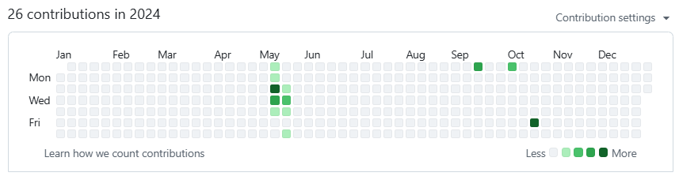
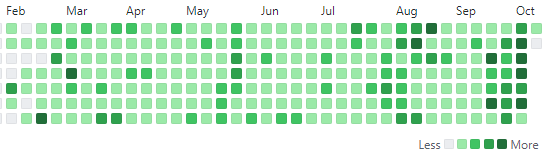
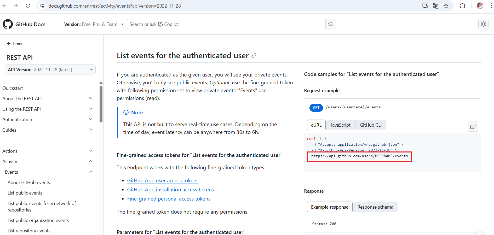
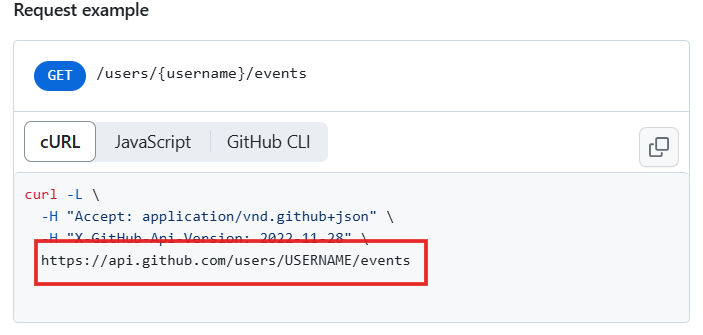
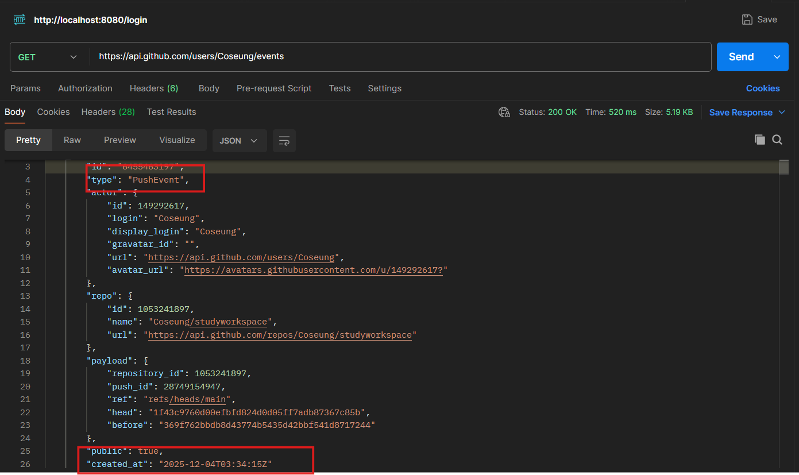

## 깃허브 잔디 


휑~


---



깃허브 잔디 관리 왜 해야할까요? 잔디 관리가 필수는 아니지만 포트폴리오 보시는 분 입장에서 조금이라도 
>얘 관리좀 했나보네 

라는 이미지를 줘야하지 않을까요.

 

---
## 잔디관리 프로젝트 
잔디관리를 하다보면 **"내가 오늘 깃헙에 푸쉬를했나?"**, **"했던거 같은데 무슨 내용이였지?"** 이렇게 까먹는 일이 무조건 일어나는데요

그럴땐 이 프로그램으로 잔디 관리를 하면 됩니다. 


| 페이지 이름         | 설명(역할) |
|---------------------|----------------------------------------------|
| 푸시 기록 페이지    | 
      |     |
| 푸시 상세 페이지    | 
| |
| 메모 기록 페이지    |  


[잔디관리 프로그램 링크](https://coseung.github.io/CommitChallenge_React/)

---
## 기능 

#### 개발 : React + vite + localStorage
전체 흐름 요약 본격적인 기능 설명에 앞서, 이 프로젝트는 기본적으로 fetch로 깃허브 데이터를 받아와 Context로 상태를 전역에서 관리하고, React Router를 통해 필요한 데이터를 각 페이지에 효율적으로 전달하는 방식으로 구현하였습니다.

---

**1. 깃허브 API 연동 (GET)**
가장 중요한 건 내 커밋 내역을 어떻게 가져오느냐 겠죠 일일이 손으로 입력하는 건 말이 안 되니까요. GitHub에서 제공하는 REST API를 사용해서 해결했습니다.

사용 방법은 깃허브 공식 홈페이지에 REST API 사용하는법이 아주 친절하게 나와있습니다. 


[깃허브 api 공식 홈페이지](https://docs.github.com/en/rest/activity/events?apiVersion=2022-11-28)






여기 USERNAME에 각자의 아이디를 넣어 요청을 하면 


위 사진처럼 이벤트 타입, 레포지토리 이름, 푸시 날짜 등 모든 활동 내역이 담긴 JSON 응답을 줍니다.

응답 결과 중 **PushEvent** (푸시 내역)만 골라내고,

**created_at** (생성 날짜)이 '오늘 날짜'와 일치하는지 비교합니다.

이렇게 필터링 된 오늘의 푸시 데이터는 Context API에 담아 앱 전역에 뿌려주는 방식으로 구현했습니다.

```js
const response = await fetch(`https://api.github.com/users/${targetUsername}/events`);  
if (!response.ok) throw new Error("유저를 찾을 수 없습니다.");

const events = await response.json();
const today = new Date().toDateString(); // 오늘 날짜

const todayPushes = events.filter(event => {
    const eventDate = new Date(event.created_at).toDateString();
    //  푸시 이벤트이면서  날짜가 오늘인 것만 리턴
    return event.type === 'PushEvent' && eventDate === today
});
```

**2. 메모 저장시 localstorage 사용**

보통 localStorage.setItem을 컴포넌트 안에서 직접 호출하는 경우가 많았는데, 이렇게 하면 **문자열로 된 키값('pushMemos')을 매번 직접 입력해야 합니다**. 

그러다 보면 **코드가 길어지고, 오타가 날 위험이** 있기도합니다. 실제로 저도 's' 하나를 빼먹어서 저장이 안 되는 바람에 원인을 찾느라 시간을 허비한 경험이 있습니다.

그래서 저장 로직을 **MemoContext 한 곳으로 모아서 관리**하도록했고. MemoContext에서 **useEffect를 사용해서 memos 상태가 변할 때마다 자동으로 로컬스토리지에 저장되도록** 구현했습니다.


기존코드

```js
const handleAddMemo = () => {
    if (!memoText.trim()) return;

    const savedMemosJson = localStorage.getItem('pushMemos'); 
    const currentMemos = savedMemosJson ? JSON.parse(savedMemosJson) : [];

    const newMemo = {
        id: Date.now(),
        pushId: detailId,
        date: pushData.created_at,
        repoName: pushData.repo.name,
        branch: pushData.payload.ref ? pushData.payload.ref.replace('refs/heads/', '') : 'main',
        memo: memoText,
        createdAt: new Date().toISOString(),
    };

    const updatedMemos = [...currentMemos, newMemo];

    localStorage.setItem('pushMemos', JSON.stringify(updatedMemos));

    setMemos(updatedMemos.filter(memo => memo.pushId === detailId));
    setMemoText('');
    
    alert('메모가 저장되었습니다!');
    navigate(ROUTES.MEMOLIST);
}
```

Context 에서 관리 후 저장 로직 ⬇️⬇️
```js
const handleAddMemo = () => {
    if( !memoText.trim()) return;

    addMemo(detailId,pushData,memoText); //Context 로직에서 처리
    setMemoText('');
    setMemos(getMemosByPushId(detailId));
    alert('메모가 저장되었습니다!');
    navigate(ROUTES.MEMOLIST);
  }
```

---
## 느낀점 

처음에는 기능 구현에만 급급해서 컴포넌트 안에서 fetch도 하고 localStorage 저장도 하고 로직을 다 때려 넣었더니, 나중에 수정하려고 할 때 코드가 너무 복잡해서 손대기가 힘들었습니다.

하지만 Context를 사용하여 로직을 컴포넌트와 분리하고 나니, 코드가 훨씬 깔끔해지고 유지보수하기가 편하다는 것을 확실히 체감했습니다.

좀 더 구현하여 추가 해볼만한 기능은 깃허브에서 Commit 내용을 가져와 Commit 내용을 보고 회고록을 Ai로 자동으로 써주는 기능, Commit 메세지를 고민하는 사람들을 위해 Commit 메세지 추천 해주기 등 기능을 추가 하여 업그레이드 해보고싶습니다.

---
깃허브 링크
[잔디관리 프로그램](https://github.com/Coseung/CommitChallenge_React)