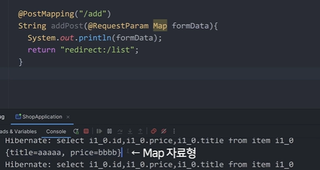

# 상품 추가기능 1(Map자료형)

1. 상품이름, 가격 작성할 수 있는 페이지와폼
2. 전송버튼을 누르면 DB에 저장 (서버 에서 검사→ DB저장)

write.html 생성 (추가 페이지)

```java
<form action="/add" method ="POST">
    <input name = "title">
    <input name = "price">
    <button>전송</button>
</form>
```

input 에는 name속성이 꼭 있어야함 

데이터를 전송하면 처리해주는 서버 코드 작성

```java
 @PostMapping("/add")
    String add(String title, Integer price) {
        System.out.println(title);
        System.out.println(price);
        return "redirect:/list";//페이지 리다이렉트 하는 코드
    }
```

input데이터가 100개 일때 Map 자료형 사용 


Map자료형 

```java
var test = new HashMap<>();
test.put("name", "kim");

//put으로 데이터를 집어넣을 수 있고 put(이름, 벨류)
```



Map 자료형을 쓰면 한변수에 여러개의 결과값을 집어 넣을 수 있음 

### 데이터베이스 에 추가 방법

Post요청을 했을때 경로 : (/add)


Item 클래스를 불러오고 

setter 사용후 

save() — 꼭해줘야함 

---

itemRepository 를 사용하여 save 해줌

var object = new Item()

 

itemRepository.save(object)

input 데이터 들을 쉽게 받을때 
@ModelAttribute 를 사용하여 오브젝트형태로 받을 수 있음 

즉 

```java
var 오브젝트 = new Item()
//이딴식으로 안써도 됨
```


### 타임리프 방식으로 HTML 복붙 가능

fragment 문법

nav.html


write.html


위의 이름(navbar)으로 덮어써줌

덮어써준 html을 다른 html에 적용 시킬 수 있음 

```java
th:replace = “~{ 파일 경로::이름 }”
```


# 상세 페이지 만들기 2& 예외처리

url 파라미터를 사용하여 상세 페이지 작성 


detail/1 로 접속해도 같은 페이지 전송

detail/2로 접속해도 같은 페이지 전송 


Optional<Item> 을 쓰는 이유 

비어있을수 있고 차있을 수 있다.


id가 100인경우  null 이 출력됨 

Optional 변수가 null이 아닐때 if문 작성


isPresent를 사용 

파라미터의 id를 가져오고 싶을때 는 

@PathVariable을 import해서 작성 


상세 페이지 들어가는 링크를 만들때 타임리프 사용 html


타임 리프 문법 

“@{}” 안에 작성 

문자열은 ‘’

변수는 ${}

합치는건 +

### 개발을 할때 항상 예외상황을 고려해서 코딩해야함

예를 들어) 

- 유저가 이상한 데이터 보내는것
- integer에 string을 입력 할 때

### Error 페이지 이동

타임리프 설치한 경우 

error.html 을 생성하면 자동으로 에러가 나면 error.html로 이동 해줌 

### REST API 서버를 만드는 경우에는 html을 열어주지 않음 ajax 통신이므로 코드로 작성해야함

 

try 

catch문 으로 예외 처리 작성 

```java
@GetMapping("/detail/{id}")
    String detail(@PathVariable Integer id, Model model) {
        try {
            var result = itemRepository.findAll();
            if(result.isEmpty()) {
                return "redirect:/list";
            }
            else {
                model.addAttribute("items", result);
                model.addAttribute("id", id);
            }

            return "detail.html";
        }catch (Exception e) {
            return "redirect:/list";
        }

    }
}

```

ajax 랑 통신할때는 redirect 도 안될 수도 있어서 문자를 리턴 

```java
}catch (Exception e) {
            return "에러남 ";
            
        }
```

위 코드 이외에 에러나는 것은 못잡아주기 때문에 모든 에러를 캐치해주는 스프링 문법도 있음 

모든 에러를 에러 처리 하는 함수 

```java
@ExceptionHandler(Exception.class)

public void hendler(){

return ———

}
```

위 코드는 같은 클래스 안에 에러를 모두 캐치해주는 함수 

## 하나의 함수에는 한가지 기능만 담는걸 권장

- 보통 Controller는 데이터나 html 보내는 역할
- 비지니스 로직 담는 클래스는 Service라고 부름
    - 이거저거 검사
    - DB입출력
    
     
    

### 다른곳에서 Object를 뽑으려면 3Step필요


[1.new](http://1.new) Class()할  클래스에 @Service

2.사용할 곳에서 변수로 등록 


3.클래스 안에 있는 함수 사용


위는 롬복 문법 

롬복 문법 사용 하지않고 기존 방식 대로 코딩 하면 


this.itemRepository 이렇게 집어넣어야함 

@Autowired 는 위에 써주면 좋음 

바깥에서 오브젝트 하나 뽑아서 집어넣는 방법 

디펜던시 인젝션 

**dependency injection**

개발 언어 두개

- Container
- Bean

스프링에서 오브젝트를 뽑는 공간 이 Container

공간 안에 오브젝트 가 Bean

