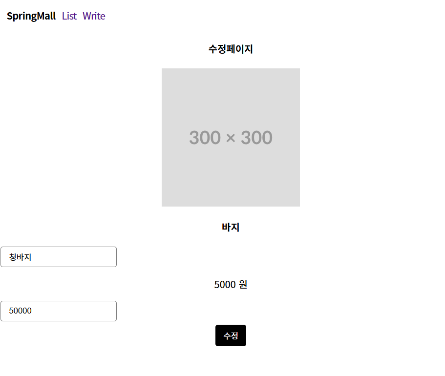
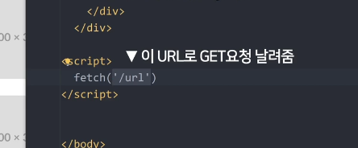

# 상품 수정, 삭제 기능(DB)

# 상품 수정기능 

상품 아이디 가져와서 

id에 관한 테이블 정보 가져오고 

폼데이터 에서 입력받은 데이터 집어넣기 

retext.html (수정 페이지 생성)

```java
<div class="detail">
    <h4>수정페이지</h4>
    <form action="/modi" method="post">
        
        <input name ="id" th:value="${id}" style="display: none">
        <h4 th:text ="${items.get(id).title}">금도금 바지</h4>
        <input name ="title">
        <p th:text ="${items.get(id).price + ' 원'} ">7억</p>
        <input name="price">
        <button type="submit"> 수정 </button>
    </form>
</div>
```

id, title, price를 넘겨줌 

ItemController.java(컨트롤러 postmapping)

```java

    @PostMapping("/modi")
    String modi(@RequestParam Long id,@RequestParam String title,@RequestParam Integer price) {
        itemService.updateItem(id+1, title, price);
        return "redirect:/list";
    }
}

```

넘겨진 id, title, price

ItemService.java

```java
public void updateItem(Long id, String title, Integer price){
        Optional<Item>  optionalItem =itemRepository.findById(id);
        if(optionalItem.isPresent()){
            Item item = optionalItem.get();
            item.setTitle(title);
            item.setPrice(price);
            itemRepository.save(item);

        }
    }
```

updateItem 함수 작성, 

위 처럼 해도되고 

```java
Item item = new Item();
item.setId(id) //id 를 가져온다는 뜻. 
//1이면 1행을 가져와 수정 없으면 추가

item.setTitle(title);
item.setPrice(price);
itemRepository.save(item);
```

이런식으로 해도된 

css 이상하지만 작동 됨




# 삭제 방법

### Ajax 사용  삭제방법



fetch라는 자바스크립트 함수를 작성 


ajax 보낼때는 body에 JSON.stringify() 로 데이터를 보내야함

보낸 body 데이터는 Controller에서 @RequestBody 로 데이터 받아올수 있음 


### 서버로 데이터 보내고 싶으면 <form>,AJAXbody말고 URL로 전송 가능


```jsx

```

url 다음에 

- ?이름 =값

작성  여러개 작성하고 싶으면 

- ?이름=값&이름2=값2’

삭제 기능 작성 


삭제 기능 잘됨.

### ajax요청이 끝나고 코드를 실행하려면 .then()

- 페이지 새로고침할때, 오류코드 볼때


```java
.then(r ⇒ r.text())
//서버에서 보낸 결과값이 문자다 text
// arrayList 나 Map 이다 json()
```

```java
.then(()=>{
location.reload();
})
//페이지 새로고침, delete요청만 보냈으니 새로고침을 
//해줘야 보임
```