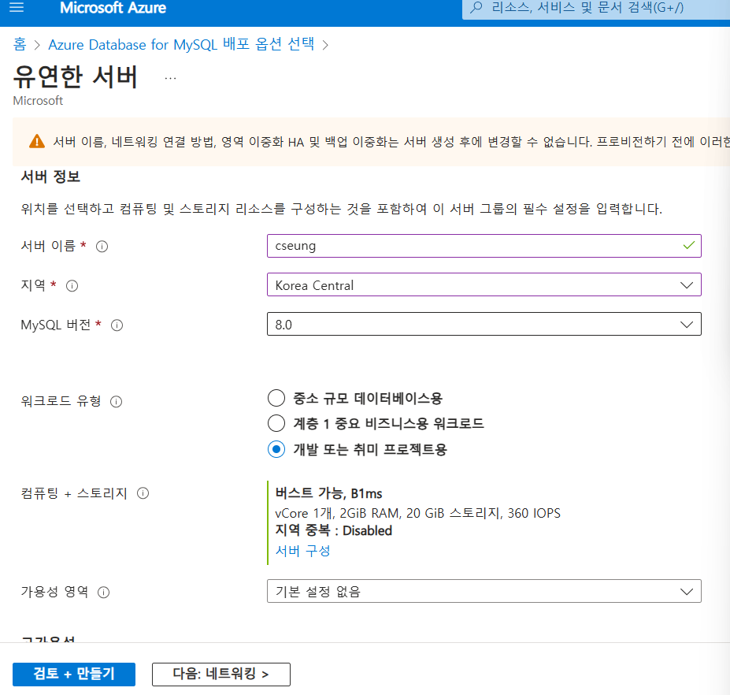

# 서버 개발 , 데이터베이스 연동


# 웹서버와 웹페이지만들기

웹 페이지 달라고 하면 웹페이지 주는 

서버 개발 

로그인페이지 달라고 하면 주는 코드 

글저장 하면 저장하는 코드 

main 안에 

com.1234.1234 에 java 파일 추가 


여기에 서버 코드 작성

@GetMapping(”/”) — 메인페이지

@ResponeseBody

String hello(){

retrurn “안녕하세요”;

}

위의 코드는 메인페이지에 접속하면 안녕하세요를 return 하는 서버 코드 


html 파일 전송 방법 

파일만 전송할려면 ResponesBody 를 지워야 한다. 

body에 있는 내용만 보여주기 때문 

### 간단 숙제

페이지 들어가면 시간 보여주기

```jsx
@GetMapping("/url")
@ResponseBody
String url(){    
return ZonedDateTime.*now*().toString();
}
```

# 상품 목록 페이지 만들기

### 상품과 관련된  API

ItemController 자바 

아무 파일에 @controller 를 붙히면 main 페이지에서 작동시켜줌

그래서 비슷한  api 들은 모아 놓기 

```jsx
pakage 경로;
//다른 페이지 클래스 가져오는법 
```

### timeleaf 라이브러리 다운 사용 방법

(템플릿 엔진)

build.gradle 파일에서 

dpendencies 에 가서 


추가 후 재시작 

사용할 html에 서버데이터 넣으려면 우선 templates 폴더에 html파일 넣어둬야함 


templates 폴더 아래로 이동

HTML에 서버 데이터를 넣으려면 

1.파라미터에 Model model 넣음 보통 model

 


1. model.addAttribute(작명,데이터);
2. 타임리프 사용방법 th:text = “${작명한 이름}”


# MYSQL Database 호스팅 받기

## 데이터 베이스 사용

**ORM**이라는 라이브러리를 사용하여 SQL 문법 을 사용 하지 않음 

azure 로 데이터베이스 만들기



azure 회원가입 + 카드 등록 후 

azure Database for MySQL 유동 서버, 고급 만들기 

서버이름은 겹치지 않게 작성 


컴퓨팅+스토리지에서 자동 크기 조정 ios 가 있으면 끄기 

DB 접속 용 ID 랑 비번 은 안전하게 작성 


방화벽 규칙은 모든 ip주소 0.0.0.0~255.255.255.255 까지 설정

만들어 졌으면 서버 매개 변수 설정 


[require_secure_transport](https://dev.mysql.com/doc/refman/8.0/en/server-system-variables.html#sysvar_require_secure_transport) OFF 

인증 을 잠깐 끄는것 

인텔리 제이에서 데이터 베이스 연동 

서버 이름
id
password 로 연결 

ORM (jpa)라이브러리 설치 , 데이터 입출력 속도는 저하 

```jsx
runtimeOnly 'com.mysql:mysql-connector-j'
implementation 'org.springframework.boot:spring-boot-starter-data-jpa'
```

gradle 에 작성  mysql connector 는 db 연결 코드 

밑은 ORM 라이브러리 코드

### **디비 접속 정보 입력**

applicaion.properties에  접속 정보입력 url, username, password 등 작성


위는 데이터베이스 추출을 했을때 sql을 보여줄지 

(개발시에는 켜두는게 좋다고함 )

아래는 테이블 생성 자기가 자동으로 할지 여부, 

(update를 하는게 안정적 , 서버 올리면 none으로 해야함)

ORM이라는 라이브러리는 @Entity 라는 클래스만 붙여주면 테이블 생성 해줌 

com.myShop.myshop/item.java


@Id 는 테이블마다 무조건 넣어줘야함 

id를 자동으로 넣어주게 하는 방법 

@GeneratedValue( strategy = GeneratiomType.IDENTITY)


변수에 public을 붙이면 다른 

모든 클래스에서 문제없이 사용가능 

@Column () 으로 컬럼에 제약설정 가능 


### Lombok 라이브러리

실제로도 많이 쓰임 

필요한 코드를 자동으로 생성해줌

build.gradle

```dart
compileOnly 'org.projectlombok:lombok'
annotationProcessor 'org.projectlombok:lombok'
```

위 코드 추가 후 

설정→ 플러그인 → Lombok 다운로드 


설정에서 annotation process 검색 후 체크박스 체크

### 데이터베이스에서 데이터 가져오기


인터페이스 파일을 하나 만들고 

[ItemRepository.java](http://ItemRepository.java)


extends 로 JapRepository 가져오기

리포지토리 만들기 , JpaRepository<Item(클래스),Long(자료형)>

<클래스, Id 의 자료형>

리포지토리를 만들면 이름과 똑같은 클래스도 만들어줌 

```dart
new ItemRepository()// 선언 방법 

```

원하는 클래스에 repository 등록 

```java
private final ItemRepository itemRepository;
```


인터페이스 의 변수를 아이템 컨트롤러 파일에서 선언해주고 

@RequiredArgsConstructor 라는 lumbook 함수 선언 


인터페이스를 사용하면 데이터베이스 입출력 함수들을 사용할 수 있음 

findAll() 모두 찾아줌 (list 자료형으로 가져와줌)

```java
itemRepository.findAll()
```

save( ???) ???내용을 데이터베이스에 넣어줌 

```java
itemRepository.save()
```

java에서 ArrayList 데이터 출력 하려면 

출력 방법 = 

```java
어레이리스트이름.get(인덱스 숫자)
```

DB 컬럼을 가져오는법 

```java
 var result = itemRepository.findAll();
 var a = new ArrayList<>();
 a.add(result.get(0).price);//결과값의 0번째 데이터의가격을 가져옴
 System.out.println(a);
```

# HTML에 서버 데이터 넣기

일단 html 꾸미기

css 파일 생성 css파일은 static 폴더에 만듬 

html 에서 link 태그로 css 가져오기 

```html
    <link rel="stylesheet" href="/main.css">
```

DB에 저장된 title 가져와보기 


```java
var result = itemRepository.findAll();
model.addAttribute("items", result.get(0));
```

위의 addAttribute로 결과 값의 0번째 를 가져옴 =item 테이블 의(0)번째 데이터 

타임 리프 문법으로 결과값의.title 을 가져옴 


DB에 있는 title = 셔츠 


반영 완 

근데 하나 만 팔꺼냐 ? 아님  

여러게 팔려면 반복문 사용 해야함 

타임 리프 문법중에 th:each 라는 반복문 돌리는 문법 이 있음 


```java
th:each ="작명 : ${model로 보내준 이름}"
```

근데 이렇게 반복 됨 


th:each 의 작명 데이터에는 파이썬의 in 처럼 리스트의 값이 들어가있음  즉 

i == items.get(i) 랑 똑같음 

그럼 

i== 1 이면 items.get(1)

i ==2 면 items.get(2)

이런식 

text에 데이터를 넣으려면  i.title 하면 끝 itmes.get(i).title 과 같기 떄문 

```html
<div class="product-container">
    <div class="card" th:each =" i : ${items}">
        
        <div>
            <h4 th:text ="${i.title}">바지</h4>
            <p th:text ="${i.price}">7억</p>
        </div>
    </div>

</div>
```


완 

### 코드관리를 도와주는 코드


public 을 안붙히면 같은 폴더의 클래스에서만 사용가능

 


extends 를 사용하여 상속 시키면 다른 폴더에서 사용가능 

private변수는 setter, getter 로 함수 만들어서 쓰면됨 

```java
public void getTitle(){
	return title;
	}
	//게터 getter함수 값 가져가는 함수
```

```java
public void setTitle(string title){
	title = this.title;
	}
	//세터 setter함수 갑 집어넣는 함수 
```

세터게터 왜만듬??

- 세터 게터로 변경하면 안전함

# 상품 추가기능 1(Map자료형)

1. 상품이름, 가격 작성할 수 있는 페이지와폼
2. 전송버튼을 누르면 DB에 저장 (서버 에서 검사→ DB저장)

write.html 생성 (추가 페이지)

```java
<form action="/add" method ="POST">
    <input name = "title">
    <input name = "price">
    <button>전송</button>
</form>
```

input 에는 name속성이 꼭 있어야함 

데이터를 전송하면 처리해주는 서버 코드 작서 ㅇ

```java
 @PostMapping("/add")
    String add(String title, Integer price) {
        System.out.println(title);
        System.out.println(price);
        return "redirect:/list";//페이지 리다이렉트 하는 코드
    }
```

input데이터가 100개 일때 Map 자료형 사용 


Map자료형 

```java
var test = new HashMap<>();
test.put("name", "kim");

//put으로 데이터를 집어넣을 수 있고 put(이름, 벨류)
```

Post요청을 했을때 경로 : (/add)


Item 클래스를 불러오고 

setter 사용후 

save() — 꼭해줘야함