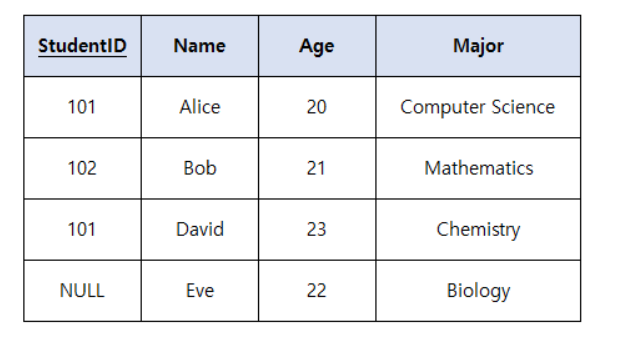

# 2024 3회 기출

## 페이지 교체 알고리즘

- 문제예시
    
    **다음은 운영체제 페이지 순서를 참고하여 할당된 프레임의 수가 3개일 때  LRU 알고리즘의 페이지 부재 횟수를 작성하시오.**
    
    **페이지 참조 순서** : 7 0 1 2 0 3 0 4 2 3 0 3 2 1 2 0 1 7 0 1
    

OPT: 앞으로 오랫동안 사용하지 않을 페이지 교체 

- 페이지 부재 횟수가 가장 적게 발생/ 효율 적이다.

FIFO: 선입 선출 

- 가장먼저 들어와 가장 오래있었던 페이지 를 교체

LRU : 최근에 가장 오랫동안 사용하지 않은(오래전에 사용된) 페이지를 교체

LFU: 사용빈도가 가장 적은 페이지를 교체 / 활발한 페이지는 교체 X

- 퀴즈
    
    ### (1)
    
    앞으로 **가장 오랫동안 사용되지 않을 페이지를 교체**하는 방식으로,
    
    페이지 부재(page fault) 횟수가 가장 적고 이론적으로 가장 효율적인 알고리즘은 무엇인가?
    
    ---
    
    ### (2)
    
    **가장 먼저 들어온 페이지를 가장 먼저 교체**하는 방식으로,
    
    구현이 단순하지만 Belady의 모순(Belady’s Anomaly)이 발생할 수 있는 알고리즘은?
    
    ---
    
    ### (3)
    
    **가장 오랫동안 사용되지 않은 페이지**, 즉 **최근에 사용된 적이 없는 페이지를 교체**하는 알고리즘은?
    
    ---
    
    ### (4)
    
    **사용 빈도(count)가 가장 낮은 페이지를 교체**하며,
    
    자주 참조되는 페이지는 교체되지 않도록 하는 알고리즘은?
    
    ---
    
    ### (5)
    
    다음 보기 중 **페이지 부재 발생 빈도가 가장 적은 알고리즘**은 무엇인가?
    
    ① FIFO
    
    ② LRU
    
    ③ LFU
    
    ④ OPT
    
    - 답
        
        

## 네트워크 취약점

- 문제
    
    **5. 다음은 네트워크 취약점에 대한 문제이다. 아래 내용을 보고 알맞는 용어를 작성하시오.**
    
    - IP나 ICMP의 특성을 악용하여 엄청난 양의 데이터를 한 사이트에 집중적으로 보냄으로써 네트워크의 일부를 불능 상태로 만드는 공격이다.
    
    - 여러 호스트가 특정 대상에게 다량의 ICMP Echo Reply 를 보내게 하여 서비스거부(DoS)를 유발시키는 보안공격이다.
    
    - 공격 대상 호스트는 다량으로 유입되는 패킷으로 인해 서비스 불능 상태에 빠진다.
    

## Dos

시스템에 비정상적인 양의 트래픽을 보내서 자원을 소모 하게 만듬 

- Smurf Attack(스머프/ 스머핑)
    - 출발지 IP를 공격대상의 IP로 변조하여, 브로드캐스팅으로 ICMP Echo 패킷 요청을 보내 과부화 시킴
- Land Attack
    - 출발지 IP와 도착지 IP를 같은 주소로 만들어, 자기 자신에게 응담을 보내도록 하는 공격

## GOF 디자인 패턴

- 문제
    
    **6. 다음은 GoF 디자인 패턴과 관련된 문제이다. 괄호안에 알맞는 용어를 작성하시오.**
    
    (        ) 패턴은 클래스나 객체들이 서로 상호작용하는 방법이나 책임 분배 방법을 정의하는 패턴이다.
    
    (        ) 패턴은 객체들 간의 통신 방법을 정의하고 알고리즘을 캡슐화하여 객체 간의 결합도를 낮춘다.
    
    (        ) 패턴은 Chain of Responsibility나 Command 또는 Observer 패턴이 있다.
    

생성패턴

- 객체의 생성 메커니즘을 다루며, 객체들을 생성하는 방식이나 생성하는 시점을 결정하는 패턴

구조패턴

- 클래스와 객체를 조합하여 더 큰 구조를 만드는 방법에 대한 패턴

행위패턴

- 객체나 클래스 사이의 상호작용 방법과 책임분배 방법을 정의한 패턴
- 퀴즈
    
    클래스와 객체를 조합하여 더 큰 구조를 만드는 방법에 대한 패턴은?
    
    객체나 클래스 사이의 상호작용 하는 방법이나 책임 분배 방법을 정의 한 패턴은? 
    
    Command , Observer패턴이 있는 
    
    Adeptor, builder 등 있는 패턴 
    
    객체의 생성 메커니즘을 다루고, 객체들을 생성하는 방식이나 생성하는 시점을 결정하는 패턴 
    

## 무결성

- 문제
    
    **다음은 무결성제약조건에 대한 문제이다. 아래 표에서 어떠한 (       ) 무결성을 위반하였는지 작성하시오.**
    
     ****
    
    
    

개체 무결성

- 개체 무결성은 기본테이블의 기본키를 구성하는 어떤 속성도 null 값이나 중복값을 가질 수 없다는 규정

참조 무결성

- 참조 무결성은 외래키 값은NULL이거나 참조 릴레이션의 기본키 값과 동일해야한다.

도메인 무결성

- 도메인 무결성은 주어진 속성값이 정의된 도메인에 속한 값이어야 한다는 규정

## 테스트 커버리지

- 문제
    
    **다음은 테스트 커버리지에 대한 문제이다. 아래 내용에 알맞는 답을 보기에서 골라 작성하시오.**
    
    1. 테스트를 통해 프로그램의 모든 문장을 최소한 한 번씩 실행했는지를 측정
    
    2. 프로그램 내의 모든 분기(조건문)의 각 분기를 최소한 한 번씩 실행했는지를 측정
    
    3. 복합 조건 내의 각 개별 조건이 참과 거짓으로 평가되는 경우를 모두 테스트했는지를 측정
    
    ### **보기**
    
    ㄱ. 조건     ㄴ. 경로      ㄷ. 결정      ㄹ. 분기      ㅁ.함수          ㅂ. 문장      ㅅ. 루프
    

### 화이트박스 테스트

- 모듈안의 내용(작동)을 직접 볼 수 있으며, 내부의 논리적인 모든경로를 테스트
- 소스코드의 모든 문장을 한번이상 수행/ 논리적 경로 점검(선택, 반복)
- 테스트 데이터를 선택하기 위해 검증 기준 커버리지 정함

화이트박스 검증 기준 

- 구문(문장)커버리지 : 프로그램 내 모든 명령문을 적어도 한번 수행
- 결정(분기) 커버리지: 프로그램내 전체 결정 분기가 적어도 한번씩 실행 되어 참/ 거짓 결과를 수행
- 조건 커버리지: 결정 명령문 내의 각 개별 조건식이 적어도 한번은 참/ 거짓 결과를 수행
- 조건/결정 커버리지 : 전체 조건식 뿐 아니라 개별 조건식도 참 한번 이상, 거짓 한번이상 결과 수행
- 변경 조건/ 결정 커버리지 :Modified Condition/Decision Coverage 각 개별조건식이 독립적으로 전체 조건식의 결과에 영향
- 다중 조건 커버리지 : 결정 포인트 내 모든 개별조건식의 모든 가능한 논리적 조합을 고려하여 100% 커버리지 보장

화이트 박스 테스트 종류

- 기초 경로 검사
    - 대표적 화이트박스 테스트 기법（동적 테스트）
    - 테스트케이스 설계자가 절차적 설계의 논리적 복잡성을 측정할 수 있게 해주는 테스트 기법
    - 측정 결과는 실행 경로의 기초를 정의 하는 지침으로 사용
- 제어구조 검사
    - 조건검사： 프로그램 모듈내 논리적 조건 테스트
    - 루프검사 ： 프로그램 반복 구조 테스트
    - 자료흐름 검사： 변수 정의와 변수 사용의 위치 테스트
- 퀴즈
    
    ### (1)
    
    프로그램 내 **모든 명령문이 한 번 이상 수행되었는지**를 확인하는 커버리지 기준은?
    
    ---
    
    ### (2)
    
    - *모든 분기(결정)**가 참(True)과 거짓(False) 모두 한 번 이상 수행되었는지를 확인하는 기준은?
    
    ---
    
    ### (3)
    
    결정문 안의 **각 개별 조건식이 참/거짓 각각 한 번 이상 수행**되었는지를 검사하는 커버리지는?
    
    ---
    
    ### (4)
    
    결정문 전체뿐만 아니라 **개별 조건식도 각각 참/거짓으로 수행**되는 커버리지는?
    
    ---
    
    ### (5)
    
    **각 조건식이 전체 조건식 결과에 독립적으로 영향을 주는지** 확인하는 커버리지는?
    
    ---
    
    ### (6)
    
    **결정문 내 모든 개별 조건식의 가능한 논리 조합을 100% 수행**하는 커버리지는?
    
    ---
    
    ### (7)
    
    화이트박스 테스트 중, **절차적 설계의 논리적 복잡도를 측정**하고
    
    실행 경로의 기초를 정의하는 테스트 기법은?
    
    ---
    
    ### (8)
    
    화이트박스 테스트 중 **변수 정의와 사용의 위치를 검사**하는 테스트 기법은?
    
    - 정답
        
        
        | 번호 | 정답 | 핵심 키워드 | 요약 설명 |
        | --- | --- | --- | --- |
        | **(1)** | **구문(문장) 커버리지** | 모든 명령문 | 프로그램 내 **모든 문장 한 번 이상 실행** |
        | **(2)** | **결정(분기) 커버리지** | 분기 결과 | **모든 분기문**이 True/False 각각 수행 |
        | **(3)** | **조건 커버리지** | 개별 조건식 | 결정문 내 **각 조건식이 참/거짓 각각 수행** |
        | **(4)** | **조건/결정 커버리지** | 조건 + 분기 모두 | **결정 전체 + 개별 조건식** 모두 True/False 수행 |
        | **(5)** | **변경 조건/결정 커버리지 (MC/DC)** | 독립적 영향 | **각 조건이 결과에 독립적 영향** 미치는지 확인 |
        | **(6)** | **다중 조건 커버리지** | 모든 조합 | **모든 조건의 가능한 논리 조합 100% 수행** |
        | **(7)** | **기초 경로 검사 (Basis Path Testing)** | 논리 복잡도 | 절차적 설계의 **논리적 복잡도 측정 & 경로 기반 테스트** |
        | **(8)** | **자료 흐름 검사 (Data Flow Testing)** | 변수 정의/사용 | 변수의 **정의-사용 위치 관계 검사** |

## UML

객체지향 소프트웨어 개발과정에서 산출물을 명세화, 시각화, 문서화 할때 사용되는 모델링 기술과 방법론을 통합해서 만든 범용 모델링언어이다. 

UML은 비즈니스 프로세스 개발 분야에 특화되어 사용 - 발전되었다. 

UML은 방법론을 통합한 것으로, 표준화된 모델링 기법을 제공한다. 

UML의 특징 

| 가시화 언어 | 개념모델 작성 시 오류가 적고 의사소통이 용이  |
| --- | --- |
| 구축언어 | 다양한 프로그래밍 언어로 실행 시스템의 예측 가능  |
| 구축언어 | UML을 소스코드로 변환하여 구축가능, 역변환하여 역공학 가능  |
| 명세화 언어 | 정확한 모델 제시, 완전한 모델 작성가능  |
| 문서화 언어  | 시스템에 대한 평가 및 의사소통의 문서  |
|  |  |

UML의 종류 

사물(Things) : 구조(개념, 물리적요소) / 행동/ 그룹 /주해 

관계(Relationship) : 

연관관계 

- 2개의상의 사물이 서로관련
- 실선 화살표로 작성ㅓ
- 양방향 관계일 경우 화살표를 생략

집합 관계 

- 하나의 사물이 다른사물에 포함 (전체-부분 관계)
- 프린터 는 컴퓨터에 연결 해서 사용 가능 다른컴퓨터에연결해서 사용할 수도있다.

일반화 관계 

- 한 사물이 다른 사물에 비해 일반/ 구체적인지 표현
- 한 클래스가 다른클래스를 포함하는 상위 개념일때
- 빈삼각형 화살표 일때

의존관계

- 사물간 서로 영향을 주는 관계
- 한클래스가 다른클래스의 기능을 사용할때

실체화 관계 

- 한 객체가 다른 객체에게 오퍼레이션을 수행 하도록 지정 /서로를 그룹화 할 수 있는 관계
- 점선 + 빈삼각형

다이어그램(Diagram):

구조 정적 다이어그램 (클객 컴배 복패)

- 클래스
    - 객체들을 클래스로 추상화 하여 표현하는 다이어그램으로  대표적인 구조 적 다이어그램 이다
    - 시스템을 구성하는 **클래스 사이의 관계**를 표현한다.
- 객체
    - 시스템 내의 객체와 이들간의 관계를 표현
    - 인스턴스를 특정시점의 객체와 객체 사이의 관계로 표현
    - 럼바우 객체지향 분석 기법에서 객체 모델리에 활용됨
- 컴포넌트
    - 구현 단계에서 사용된다.
    - 구현 모델인 컴포넌트 간의 관계표현
- 배치
    - 구현단계에서 사용
    - 물리적 요소/ 구조표현
    - 소프트웨어, 하드웨어, 네트워크를 포함한 실행 시스템의 물리구조를 표현함
- 복합체구조
    - 시스탬 내 복합 구조를 표현
    - 클래스나 컴포넌트가 복합구조를 같는경우 내부 구조를 표현
- 패키지
    - 시스템의 패키지와 이들간의 관계를 표현
    - 클래스나 유스케이스 등 을 표함한 여러 모델요소들을 그룹화 하여 패키지를 구성하고 패키지들 사이의 관계를 표현한다.

행위 동적 다이어그램 (유시커 상활상타)

- 유스케이스
- 시퀀스
- 커뮤니케이션
- 상태
- 활동
- 상호작용
- 타이밍

- 퀴즈
    
    구현단계 에서 사용 , 물리적 요소/ 구조 표현